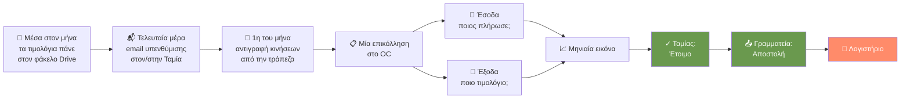
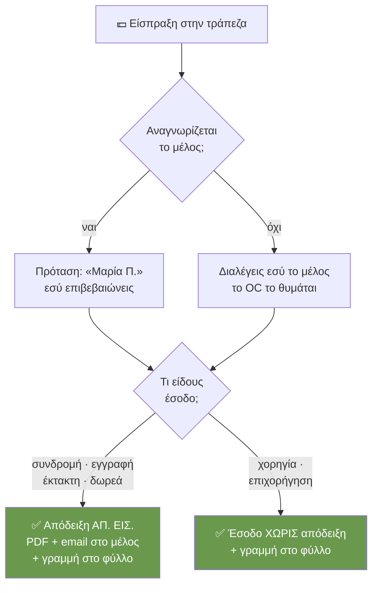
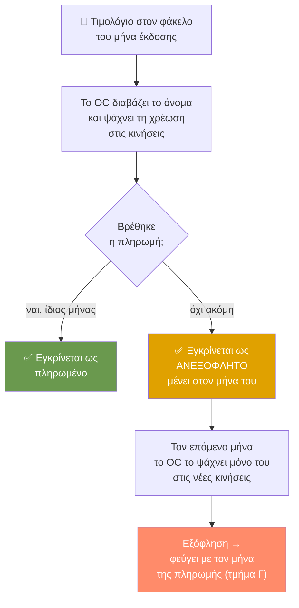
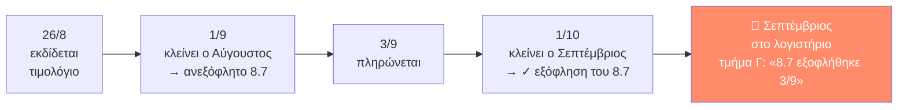
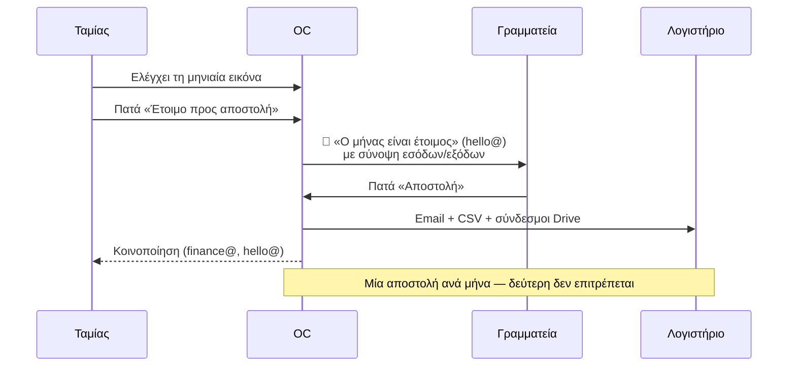

# Τα Οικονομικά του OC με απλά λόγια

*Για τα μέλη του ΔΣ που δεν είναι τεχνικοί. Κατάσταση: 30 Αυγούστου 2026.*

Αυτός ο οδηγός εξηγεί **τι κάνει το Operational Center (OC) με τα χρήματα** του Culture for Change: πώς μπαίνουν τα έσοδα, πώς μπαίνουν τα έξοδα, και πώς κάθε μήνας «κλείνει» και φεύγει προς το λογιστήριο. Δεν χρειάζεται να ξέρεις τίποτα από υπολογιστές. Για κάθε περίπτωση που μπορεί να συναντήσεις υπάρχει **ένα απλό παράδειγμα**.

---

## 1. Οι τέσσερις «παίκτες»

| Ποιος | Τι κάνει |
|---|---|
| **Η τράπεζα** (Alpha) | Λέει *πόσα μπήκαν, πόσα βγήκαν και πότε*. Δεν ξέρει *γιατί*. |
| **Ο/η Ταμίας** | Επικολλά τις κινήσεις της τράπεζας στο OC, επιβεβαιώνει ποιος πλήρωσε, εγκρίνει τα έξοδα, δηλώνει τον μήνα «έτοιμο». |
| **Η Γραμματεία / το IT** | Πατά την τελική «Αποστολή» προς το λογιστήριο. Το IT κάνει και τις σπάνιες χειροκίνητες καταχωρήσεις. |
| **Το λογιστήριο** | Λαμβάνει μία φορά τον μήνα ένα email με όλα τα έσοδα, όλα τα έξοδα και συνδέσμους στα παραστατικά. |

**Ο ένας κανόνας που εξηγεί τα πάντα:** η τράπεζα λέει *πόσα και πότε*, το όνομα του αρχείου λέει *τι και από ποιον*, το OC δίνει *τον αριθμό*, και ο άνθρωπος δίνει *την έγκριση*. **Τίποτα δεν εκδίδεται και τίποτα δεν στέλνεται χωρίς να το πατήσει άνθρωπος.**

---

## 2. Ο μηνιαίος κύκλος με μια ματιά



Το OC **δεν αντικαθιστά** το φύλλο ΕΣΟΔΑ-ΕΞΟΔΑ (το Excel) ούτε το Drive. Τα **γράφει**. Ό,τι βλέπεις στην οθόνη υπάρχει και στο φύλλο, με τον ίδιο αριθμό γραμμής (Α/Α).

> **Παράδειγμα.** Είναι 1 Οκτωβρίου. Η Ταμίας μπαίνει στην τράπεζα, αντιγράφει τις κινήσεις του Σεπτεμβρίου, τις επικολλά στο OC, επιβεβαιώνει 6 συνδρομές και 4 τιμολόγια, κοιτάζει τη μηνιαία εικόνα και πατά «Έτοιμο». Στις 2 Οκτωβρίου η Γραμματεία πατά «Αποστολή» και το λογιστήριο λαμβάνει τον Σεπτέμβριο. Συνολικός χρόνος: κάτω από μία ώρα.

---

## 3. Δύο αριθμοί που δεν πρέπει να μπερδεύονται

- **Α/Α** — η θέση της γραμμής μέσα στον μήνα: 9.1, 9.2, 9.3… (9 = Σεπτέμβριος). Με αυτόν μιλά το λογιστήριο. Το 9.10 έρχεται **μετά** το 9.9 — είναι «μήνας.σειρά», όχι δεκαδικός.
- **ΑΠ. ΕΙΣ.** — ο νόμιμος αύξων αριθμός της **απόδειξης είσπραξης**: 365, 366, 367… Τρέχει συνεχόμενα όλο τον χρόνο και τον δίνει **μόνο το OC**.

⚠ Ποτέ μη γράψεις αριθμό ΑΠ. ΕΙΣ. με το χέρι στο Excel. Θα βγει διπλός αριθμός και δεν ξεμπερδεύεται εύκολα.

---

## 4. Τα ΕΣΟΔΑ — όλες οι περιπτώσεις

Όταν επικολλήσεις τις κινήσεις, το OC κοιτάζει κάθε **είσπραξη** και ρωτά: *ποιος είναι αυτός και τι πλήρωσε;*



### 4.1 Η απλή συνδρομή

Το μέλος έστειλε τη συνδρομή του. Το OC αναγνωρίζει το όνομα του καταθέτη — ακόμη κι αν η τράπεζα το γράφει με λατινικά και ανάποδα («PAPADOPOULOU MARIA») — και σου προτείνει το μέλος. Εσύ πατάς επιβεβαίωση. Αυτόματα: παίρνει τον επόμενο αριθμό ΑΠ. ΕΙΣ., φτιάχνεται η απόδειξη σε PDF, στέλνεται email στο μέλος, γράφεται η γραμμή στο φύλλο και το PDF μπαίνει στον φάκελο του μήνα.

> **Παράδειγμα.** Στις 12/9 μπαίνουν 35 € από «PAPADOPOULOU MARIA». Το OC προτείνει «Μαρία Παπαδοπούλου — συνδρομή 2026». Επιβεβαιώνεις. Βγαίνει η απόδειξη **ΑΠ. ΕΙΣ. 371**, γραμμή **9.3** στο φύλλο, και η Μαρία λαμβάνει το PDF στο email της.

### 4.2 Το μέλος δεν αναγνωρίζεται

Το όνομα στην τράπεζα δεν ταιριάζει με κανένα μέλος (π.χ. πλήρωσε ο σύζυγος, ή από εταιρικό λογαριασμό). Το OC δεν μαντεύει — σου ζητά να διαλέξεις εσύ. **Και το θυμάται:** την επόμενη φορά που θα καταθέσει το ίδιο όνομα, η πρόταση θα είναι άμεση.

> **Παράδειγμα.** Έρχονται 35 € από «K. ANTONIOU». Καμία πρόταση. Ξέρεις ότι είναι ο σύζυγος της Ελένης Αντωνίου· τη διαλέγεις από τη λίστα. Τον Σεπτέμβριο του 2027, το «K. ANTONIOU» θα προταθεί αμέσως ως Ελένη Αντωνίου.
>
> ⚠ Αν διαλέξεις **λάθος** μέλος, το OC θα μάθει και το λάθος. Πες το στο IT για να σβηστεί η αντιστοίχιση.

### 4.3 Δύο χρόνια μαζί → δύο αποδείξεις

Αν κάποιος χρωστά 2025 **και** 2026 και τα πληρώσει με μία μεταφορά, βγαίνουν **δύο** αποδείξεις, μία για κάθε έτος, με χωριστούς αριθμούς. Το λογιστήριο θέλει κάθε έσοδο στη χρονιά που αφορά.

Κάθε γραμμή είσπραξης έχει πεδίο **«Έτος»** που μπορείς να αλλάξεις — έτσι δηλώνεις σε ποια χρονιά ανήκει η απόδειξη.

> **Παράδειγμα.** Ο Νίκος στέλνει 70 € για 2025 και 2026. Εκδίδεις δύο αποδείξεις των 35 €: μία με έτος 2025 (**ΑΠ. ΕΙΣ. 372**) και μία με έτος 2026 (**ΑΠ. ΕΙΣ. 373**). Ο Νίκος λαμβάνει δύο PDF και το λογιστήριο βλέπει κάθε ποσό στη σωστή χρονιά.

### 4.4 Χορηγία ή επιχορήγηση → έσοδο χωρίς απόδειξη

Για χορηγίες και επιχορηγήσεις **δεν** εκδίδεται απόδειξη είσπραξης· παραστατικό είναι η ίδια η τραπεζική κίνηση. Το OC τα γράφει ως «έσοδο χωρίς απόδειξη». Παίρνουν Α/Α στο φύλλο, αλλά **όχι** ΑΠ. ΕΙΣ.

> **Παράδειγμα.** Ο Δήμος καταθέτει 500 € επιχορήγηση στις 20/9. Το δηλώνεις «επιχορήγηση». Γράφεται ως γραμμή **9.5** στο φύλλο, χωρίς αριθμό απόδειξης, με τον αριθμό συναλλαγής της τράπεζας ως παραστατικό.

### 4.5 Το μέλος λέει «πλήρωσα» αλλά η τράπεζα δεν το δείχνει

Στη σελίδα του, το μέλος μπορεί να δηλώσει «Πλήρωσα». Αυτό **δεν** εκδίδει τίποτα — απλώς ανάβει μια ένδειξη. Αν το ποσό δεν εμφανιστεί ποτέ στην τράπεζα, υπάρχει η επιλογή «Αποτυχία», που στέλνει ευγενικό email στο μέλος ότι η μεταφορά δεν έφτασε.

> **Παράδειγμα.** Η Άννα δήλωσε «Πλήρωσα» στις 5/9. Μέχρι τις 30/9 δεν υπάρχει είσπραξη στο όνομά της. Πατάς «Αποτυχία»· η Άννα λαμβάνει email «η μεταφορά σας δεν έφτασε — ελέγξτε με την τράπεζά σας». Καμία απόδειξη δεν εκδόθηκε.

### 4.6 Απόδειξη σε μήνα που έχει ήδη σταλεί

Αν εκδοθεί απόδειξη για μήνα που έχει ήδη φύγει προς το λογιστήριο, το OC τη σημαδεύει **κόκκινη** στη μηνιαία εικόνα ως «δέλτα» και τη μετρά χωριστά. Δεν την κρύβει και δεν την ξαναστέλνει μόνο του — η Γραμματεία ενημερώνει το λογιστήριο.

> **Παράδειγμα.** Ο Αύγουστος στάλθηκε στις 3/9. Στις 10/9 ανακαλύπτεις ότι μία είσπραξη της 28/8 είχε ξεχαστεί και εκδίδεις την απόδειξη. Στη μηνιαία εικόνα του Αυγούστου εμφανίζεται κόκκινη με την ένδειξη «1 δέλτα».

---

## 5. Τα ΕΞΟΔΑ — όλες οι περιπτώσεις

Τα τιμολόγια **δεν** τα διαβάζει κάποια τεχνητή νοημοσύνη. Το OC διαβάζει μόνο **το όνομα του αρχείου** που δίνεις εσύ στο Drive. Γι' αυτό το όνομα έχει σημασία:

```
{σε ποιον}_{αριθμός}_{ΜΑΡΚ}_{ΗΗ-ΜΜ-ΕΕΕΕ}_{ποσό}.pdf
```

Ό,τι δεν ξέρεις (π.χ. ΜΑΡΚ) απλώς το παραλείπεις. Το Α/Α το βάζει το OC όταν εγκρίνεις.

**Πού πάει το τιμολόγιο;** Στον φάκελο του μήνα **που εκδόθηκε**, όχι που πληρώθηκε.



### 5.1 Το απλό τιμολόγιο

Εκδόθηκε και πληρώθηκε μέσα στον ίδιο μήνα. Το OC το ταιριάζει με τη χρέωση της τράπεζας και σου το δείχνει έτοιμο για έγκριση.

> **Παράδειγμα.** Αποθηκεύεις στον φάκελο Σεπτεμβρίου το αρχείο
> `ΑΒ Βασιλόπουλος_4471-88012_400014700880013_08-09-2026_62,50.pdf`.
> Στις κινήσεις υπάρχει χρέωση 62,50 € στις 8/9. Το OC τα ενώνει, εγκρίνεις, γίνεται γραμμή **9.2** στο φύλλο.

### 5.2 Τιμολόγιο με κρατήσεις (σύνολο ≠ πληρωτέο)

Κάποια τιμολόγια (π.χ. αμοιβές) έχουν άλλο σύνολο κι άλλο ποσό που πληρώνεται, γιατί μεσολαβεί παρακράτηση. Στο όνομα του αρχείου γράφεις **σύνολο→πληρωτέο** (ή `->` αν δεν βρίσκεις το βέλος). Το OC υπολογίζει μόνο του τις κρατήσεις.

> **Παράδειγμα.** `Παπαδοπούλου_112_18-09-2026_120,00→96,00.pdf`
> Το OC καταλαβαίνει: σύνολο 120,00 €, πληρωτέο 96,00 €, κρατήσεις 24,00 €. Ταιριάζει τη χρέωση **96,00 €** της τράπεζας και γράφει και τα τρία ποσά στο φύλλο.

### 5.3 Εκδόθηκε τον έναν μήνα, πληρώθηκε τον επόμενο

Η πιο συχνή «δύσκολη» περίπτωση. Το τιμολόγιο ανήκει στον **μήνα έκδοσης**. Αν η πληρωμή δεν φαίνεται στις κινήσεις εκείνου του μήνα, το εγκρίνεις ως **ανεξόφλητο** — μένει στον μήνα του. Τον επόμενο μήνα, **πριν** επικολλήσεις, το OC σου δείχνει τη λίστα «Ανεξόφλητα από προηγούμενους μήνες», για να ξέρεις τι να ψάξεις. Μετά την ανάλυση, όσα βρέθηκαν παίρνουν ✓ και φεύγουν προς το λογιστήριο **με τον μήνα της πληρωμής**, σε ξεχωριστό τμήμα (Γ).



> **Παράδειγμα.** Η Ντόβα εκδίδει τιμολόγιο 400 € στις 26/8· το πληρώνετε στις 3/9. Στο κλείσιμο Αυγούστου το εγκρίνεις ως ανεξόφλητο, γραμμή **8.7**. Την 1η Οκτωβρίου, μόλις διαλέξεις «Σεπτέμβριος», βλέπεις «Ανεξόφλητα από προηγούμενους μήνες: 8.7 Ντόβα 400 €». Επικολλάς τις κινήσεις, το OC βρίσκει τα 400 € της 3/9, το 8.7 παίρνει ✓. Το email Σεπτεμβρίου προς το λογιστήριο έχει ένα τμήμα Γ: «Αύγουστος 8.7 — εξόφληση 3/9».

### 5.4 Τιμολόγιο που βρέθηκε **αφού** στάλθηκε ο μήνας του

Ξέχασες ένα τιμολόγιο και το βρήκες όταν ο μήνας του είχε ήδη φύγει. Το βάζεις στον φάκελο **του μήνα έκδοσης** και το εγκρίνεις κανονικά. Γίνεται η **τελευταία γραμμή** εκείνου του μήνα (επόμενο Α/Α), όποια κι αν είναι η ημερομηνία του. Φεύγει προς το λογιστήριο **με την επόμενη αποστολή**, στο τμήμα Γ ως «νέα καταχώρηση». Μία φορά, όχι δύο.

> **Παράδειγμα.** Ο Ιούλιος στάλθηκε στις 5/8. Στις 12/8 βρίσκεις τιμολόγιο ΔΕΗ της 20/7, 74,40 €. Το βάζεις στον φάκελο Ιουλίου, το εγκρίνεις: γίνεται γραμμή **7.10** (μετά το 7.9, παρότι είναι 20/7). Όταν σταλεί ο Αύγουστος, το email έχει τμήμα Γ: «Ιούλιος 7.10 — νέα καταχώρηση». Το λογιστήριο συμπληρώνει τον Ιούλιο.

### 5.5 Τραπεζικά έξοδα (προμήθειες)

Οι προμήθειες της τράπεζας για μεταφορές εκτός Alpha είναι κι αυτές έξοδα με τιμολόγιο. Τα κατεβάζεις από το e-banking (**Έγγραφα → Τιμολόγια**) και τα ρίχνεις στον φάκελο όπως όλα τα άλλα. Επειδή η τράπεζα είναι δηλωμένη ως «αυτόματη χρέωση», το OC τα ταιριάζει αμέσως με τις χρεώσεις της ίδιας μέρας.

> **Παράδειγμα.** Στις 15/9 η Alpha χρεώνει 1,50 € προμήθεια για μεταφορά σε Εθνική. Κατεβάζεις το τιμολόγιο, το ονομάζεις `Alpha_15-09-2026_1,50.pdf`. Το OC το ταιριάζει με τη χρέωση της 15/9 χωρίς να ρωτήσει.

### 5.6 Χρέωση χωρίς τιμολόγιο → χειροκίνητη καταχώρηση (μόνο IT)

Σπάνια, μια χρέωση δεν έχει (ή δεν θα έχει ποτέ) PDF — π.χ. μια ηλεκτρονική συνδρομή που βγάζει μόνο απόδειξη στην οθόνη. Τότε τη γραμμή τη βάζει **μόνο το IT**, με το κουμπί «+ Προσθήκη», αφού συνεννοηθεί με τον/την Ταμία. Στο φύλλο γράφεται με σημείωση «Χειροκίνητη καταχώρηση από IT».

> **Παράδειγμα.** Η μηνιαία συνδρομή του Strapi (16,03 €) χρεώνεται στην κάρτα στις 3/9 χωρίς τιμολόγιο. Η Ταμίας το επισημαίνει στο IT. Το IT προσθέτει τη γραμμή χειροκίνητα, χωρίς αρχείο, και γίνεται **9.6** με τη σχετική σημείωση.

### 5.7 Το ίδιο τιμολόγιο δεύτερη φορά

Το OC ελέγχει αν το παραστατικό υπάρχει ήδη (ίδιος αριθμός, ίδιο ΜΑΡΚ ή ίδιο αρχείο). Αν υπάρχει **χωρίς** αρχείο (π.χ. είχε μπει χειροκίνητα), σου προτείνει «Σύνδεση»: το PDF κολλά στην υπάρχουσα γραμμή αντί να φτιαχτεί δεύτερη. Αν υπάρχει ήδη κανονικά, σε προειδοποιεί.

> **Παράδειγμα.** Το IT είχε βάλει το Strapi χειροκίνητα ως 9.6. Μια εβδομάδα μετά βρίσκεις το PDF και το ρίχνεις στον φάκελο. Η ανάλυση δείχνει «↳ υπάρχει ως 9.6 χωρίς αρχείο — θα συνδεθεί». Πατάς «Σύνδεση». Μία γραμμή, τώρα με αρχείο.

### 5.8 Διάλεξες λάθος μήνα

Πάνω από τα πλαίσια επικόλλησης υπάρχει το πεδίο «Μήνας αναφοράς». Αν διαλέξεις Αύγουστο και επικολλήσεις κινήσεις Σεπτεμβρίου, το OC το καταλαβαίνει από τις ημερομηνίες και σε σταματά **πριν** γράψει κάτι.

> **Παράδειγμα.** Έχεις αφήσει «Αύγουστος» από την προηγούμενη φορά και επικολλάς τις κινήσεις Σεπτεμβρίου. Εμφανίζεται: «Διάλεξες Αύγουστο 2026, αλλά οι κινήσεις είναι Σεπτεμβρίου 2026» με κουμπί «Άλλαξε τον μήνα σε Σεπτέμβριο 2026». Ένα κλικ και συνεχίζεις.

### 5.9 Το ποσό στο όνομα δεν συμφωνεί με την τράπεζα

Αν στο όνομα του αρχείου έγραψες 62,00 αλλά η τράπεζα χρεώθηκε 62,50, το OC σε προειδοποιεί «ασυμφωνία ποσού». Ισχύει **το ποσό της τράπεζας** — αυτό είναι που πραγματικά πληρώθηκε.

> **Παράδειγμα.** `Κληρονόμος_88_10-09-2026_74,00.pdf`, αλλά η χρέωση είναι 74,40 €. Το OC δείχνει κίτρινη προειδοποίηση. Εγκρίνεις με 74,40 € και, αν θέλεις, διορθώνεις το όνομα του αρχείου.

---

## 6. Το κλείσιμο του μήνα — δύο υπογραφές

Η μηνιαία εικόνα δείχνει τρία κουτιά (**Έσοδα · Έξοδα · Ισοζύγιο**) και τη λίστα κάθε γραμμής. Το κλείσιμο έχει **δύο βήματα, από δύο διαφορετικούς ανθρώπους** — επίτηδες: αυτός που ελέγχει τα νούμερα δεν είναι αυτός που τα στέλνει έξω.



**Τι λαμβάνει το λογιστήριο:**

- **Α. Έσοδα** — κάθε απόδειξη και κάθε έσοδο χωρίς απόδειξη, κατά ημερομηνία πληρωμής.
- **Β. Έξοδα** — κάθε εγκεκριμένο τιμολόγιο του μήνα, με σύνολο, κρατήσεις, πληρωτέο και τρόπο πληρωμής.
- **Γ. Εκ των υστέρων** — *μόνο αν υπάρχει*: εξοφλήσεις και νέες καταχωρήσεις για μήνες που το λογιστήριο έχει ήδη λάβει (βλ. 5.3 και 5.4).
- **Σύνολα και ισοζύγιο**, το ίδιο αρχείο και ως CSV, και **απευθείας συνδέσμους** στους φακέλους Εξόδων και Εσόδων του μήνα στο Drive.

**Η δεύτερη υπογραφή καλείται, δεν μαντεύει.** Μόλις ο/η Ταμίας πατήσει «Έτοιμο», η Διαχείριση (hello@) λαμβάνει αυτόματα email «Ο μήνας είναι έτοιμος» με τη σύνοψη — έσοδα, έξοδα, ισοζύγιο, και πόσα εκ των υστέρων περιμένουν — και κουμπί που ανοίγει τα Οικονομικά του OC.

> **Παράδειγμα.** Την 1η Οκτωβρίου η Ταμίας πατά «Έτοιμο» για τον Σεπτέμβριο. Το hello@ λαμβάνει αμέσως: «Ο Σεπτέμβριος 2026 είναι έτοιμος — Έσοδα 1.240,00 € · Έξοδα 618,40 € · Ισοζύγιο +621,60 € · +1 εκ των υστέρων». Στις 2/10 η Γραμματεία πατά «Αποστολή». Η λογίστρια λαμβάνει email: «Σεπτέμβριος 2026 — Έσοδα 1.240,00 € (7 γραμμές) · Έξοδα 618,40 € (5 γραμμές) · Ισοζύγιο +621,60 €», ένα τμήμα Γ με το 8.7 της Ντόβα, το CSV συνημμένο, και δύο συνδέσμους «φάκελος Εξόδων · φάκελος Εσόδων». Το finance@ και το hello@ παίρνουν κοινοποίηση.

---

## 7. Η υπενθύμιση στο τέλος του μήνα

Την **τελευταία μέρα κάθε μήνα**, το πρωί, ο/η Ταμίας λαμβάνει αυτόματα ένα email με τα βήματα του κύκλου — τα ίδια ακριβώς που εμφανίζονται και στο OC με το κουμπί **«🏦 Οδηγίες μηνιαίου κύκλου»**. Περιλαμβάνει και μια προσωπική σημείωση από την προηγούμενη Ταμία με πρακτικές συμβουλές.

> **Παράδειγμα.** Στις 30 Σεπτεμβρίου, 10:00, φτάνει το email «Ώρα για τον Σεπτέμβριο 2026»: 0. Προετοιμασία (τα τιμολόγια στη θέση τους) · 1. Διάλεξε τον σωστό μήνα · 2. Κινήσεις τράπεζας · 3. Ταμείο · 4. Μηνιαία εικόνα. Κάθε βήμα με μια εικόνα από το e-banking που δείχνει πού να πατήσεις.

---

## 8. Πέντε κανόνες που αξίζει να θυμάσαι

1. **Το τιμολόγιο πάει στον μήνα που εκδόθηκε**, όχι που πληρώθηκε. Η πληρωμή βρίσκεται μόνη της αργότερα.
2. **Το όνομα του αρχείου είναι η καταχώρηση.** Προμηθευτής, αριθμός, ημερομηνία, ποσό — μέσα στο όνομα.
3. **Τους αριθμούς αποδείξεων τους δίνει το OC.** Ποτέ με το χέρι.
4. **Ό,τι προκύψει αργότερα δεν χάνεται:** μπαίνει ως τελευταία γραμμή του μήνα του και φεύγει με την επόμενη αποστολή, μία φορά.
5. **Τίποτα δεν φεύγει χωρίς δύο ανθρώπους:** ο/η Ταμίας εγκρίνει, η Γραμματεία στέλνει.

*Για τις τεχνικές λεπτομέρειες: [OC-Processes.md](OC-Processes.md).*
