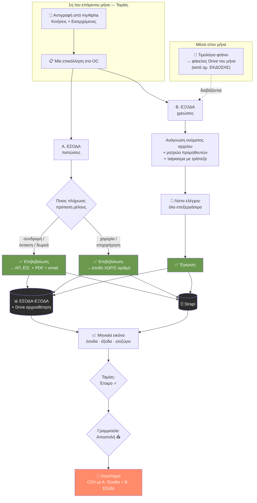

# OC — Οικονομικά & Διαχείριση

*Κατάσταση: 17 Αυγούστου 2026 · Συστήματα: Ιστοσελίδα (Next.js/Vercel) · Strapi Cloud · ΕΣΟΔΑ-ΕΞΟΔΑ Google Sheet (Apps Script) · Google Drive «Παραστατικά» · Resend (email)*

> Συμπληρωματικό του [Membership-Lifecycle-Processes.md](Membership-Lifecycle-Processes.md), που καλύπτει τον κύκλο ζωής του μέλους. Εδώ περιγράφεται τι κάνει το OC με τα **χρήματα** και τι με τη **μηνιαία αποστολή στο λογιστήριο**.
>
> Το κείμενο περιγράφει **ό,τι υπάρχει σήμερα**. Ό,τι είναι σχεδιασμένο αλλά δεν έχει υλοποιηθεί σημειώνεται ρητά ως «δεν υπάρχει ακόμη».

---

## Σελίδα 0 — Για μη τεχνικούς: τι κάνει το σύστημα με τα χρήματα

Φαντάσου ότι είσαι το νέο Ταμείο του CforC και ανοίγεις το OC την 1η του μήνα. Να τι θα συμβεί.

**1. Κατεβάζεις τις κινήσεις της τράπεζας.** Μπαίνεις στο myAlpha Web, επιλέγεις τον μήνα και **αντιγράφεις** δύο λίστες: τις «Κινήσεις» και τις «Εισερχόμενες εντολές». Δεν χρειάζεται αρχείο, ούτε σύνδεση με την τράπεζα — απλή αντιγραφή-επικόλληση.

**2. Τις επικολλάς μία φορά, στο OC.** Στα Οικονομικά υπάρχει η κάρτα «Αναφορά Εσόδων/Εξόδων». Επικολλάς εκεί τα δύο κείμενα. Η **ίδια** επικόλληση εξυπηρετεί και τα έσοδα και τα έξοδα — δεν τη δίνεις δύο φορές.

**3. Το σύστημα σού δείχνει ποιος πλήρωσε.** Για κάθε είσπραξη σου προτείνει σε ποιο μέλος αντιστοιχεί, διαβάζοντας το όνομα του καταθέτη — ακόμη κι όταν η τράπεζα το γράφει με λατινικούς χαρακτήρες («GEORGIOS PAPADOPOULOS» → Γιώργος Παπαδόπουλος). **Δεν εκδίδει τίποτα μόνο του.** Εσύ επιβεβαιώνεις κάθε γραμμή. Κάθε φορά που επιβεβαιώνεις, το σύστημα το θυμάται: την επόμενη φορά ο ίδιος καταθέτης αναγνωρίζεται αμέσως.

**4. Πατάς «Έκδοση».** Για κάθε επιβεβαιωμένη γραμμή γίνονται αυτόματα τέσσερα πράγματα: παίρνει τον **επόμενο αριθμό ΑΠ. ΕΙΣ.**, φτιάχνεται η **απόδειξη σε PDF**, στέλνεται **email στο μέλος**, και γράφεται η **γραμμή στο ΕΣΟΔΑ** με το PDF αρχειοθετημένο στον φάκελο του μήνα στο Drive. Καμία χειροκίνητη καταχώρηση.

**5. Τα τιμολόγια των εξόδων.** Όποτε έρχεται ένα τιμολόγιο μέσα στον μήνα, το ρίχνεις στον φάκελο του μήνα στο Drive — **με βάση την ημερομηνία έκδοσής του**, όχι πληρωμής. Το όνομα του αρχείου έχει σημασία: γράψε μέσα του τον προμηθευτή, τον αριθμό παραστατικού, την ημερομηνία και το ποσό. Στο τέλος του μήνα πατάς «Έλεγχος τιμολογίων» και το σύστημα τα διαβάζει όλα, τα αντιστοιχεί με τις χρεώσεις της τράπεζας, και σου τα παρουσιάζει σαν λίστα ελέγχου για να τα εγκρίνεις — ένα-ένα ή όλα μαζί.

**6. Η μηνιαία εικόνα.** Μία κάρτα δείχνει όλα τα έσοδα και όλα τα έξοδα του μήνα, με σύνολα και ισοζύγιο. Όταν είσαι σίγουρη, πατάς «Έτοιμο προς αποστολή στο λογιστήριο». Μετά — και **μόνο** μετά — η Γραμματεία μπορεί να πατήσει «Αποστολή» και το αρχείο φεύγει με email στο λογιστικό γραφείο.

**Τρία πράγματα να θυμάσαι:**

- **Τίποτα δεν στέλνεται και τίποτα δεν εκδίδεται χωρίς να το πατήσεις εσύ.** Το σύστημα προτείνει· εσύ αποφασίζεις.
- **Η αρίθμηση των αποδείξεων ανήκει στο OC.** Ποτέ μη γράψεις αριθμό ΑΠ. ΕΙΣ. με το χέρι στο Excel — θα δημιουργηθεί διπλός αριθμός και το μπέρδεμα δεν ξεμπερδεύεται εύκολα.
- **Το Excel παραμένει.** Το OC δεν το αντικατέστησε· το γράφει. Ό,τι βλέπεις στην οθόνη υπάρχει και στο φύλλο, με το ίδιο Α/Α.

---

## Σελίδα 1 — Το διάγραμμα της ροής



**Η μία γραμμή που εξηγεί τα πάντα:** η τράπεζα λέει *πόσα και πότε*, το όνομα του αρχείου λέει *τι και από ποιον*, το OC δίνει *τον αριθμό*, και ο άνθρωπος δίνει *την έγκριση*. Κανένα από τα τέσσερα δεν κάνει τη δουλειά του άλλου.

---

## Σελίδα 2 — Σύνοψη ανά ρόλο

| Ενέργεια | Ταμίας | Γραμματεία / IT | Κοινότητα | Υπόλοιπο ΔΣ |
|---|:--:|:--:|:--:|:--:|
| Προβολή Οικονομικών | ✅ | ✅ | ✅ | ✅ |
| Έκδοση απόδειξης | ✅ | — | — | — |
| Καταχώρηση εσόδου χωρίς απόδειξη | ✅ | — | — | — |
| Έγκριση εξόδων | ✅ | — | — | — |
| Υπενθύμιση συνδρομής | ✅ | — | ✅ | — |
| «Έτοιμο προς αποστολή» | ✅ | — | — | — |
| **Αποστολή στο λογιστήριο** | — | ✅ | — | — |
| Δημιουργία ετήσιων φακέλων | ✅ | — | — | — |

Η **διπλή υπογραφή** στο κλείσιμο του μήνα είναι σκόπιμη: αυτός που ελέγχει τα νούμερα δεν είναι αυτός που τα στέλνει έξω.

---

## Σελίδα 3 — Αναλυτικά

### 3.1 Η σειρά αποδείξεων ΑΠ. ΕΙΣ.

**Μία σειρά, μία αρχή.** Υπάρχει ένας ενιαίος αύξων αριθμός για κάθε είσπραξη, ανεξάρτητα από το είδος της. Η σειρά συνεχίζει από το **364**, τον τελευταίο χειρόγραφο αριθμό πριν την αυτοματοποίηση (Μ. Κιτσέλλης, 14/7/2026).

**Το OC είναι η μοναδική αρχή αρίθμησης.** Στη βάση, το πεδίο `Number` είναι υποχρεωτικό και μοναδικό — απόδειξη χωρίς αριθμό είναι αδύνατη, και δύο αποδείξεις με τον ίδιο αριθμό επίσης. Αν δύο άνθρωποι πατήσουν έκδοση ταυτόχρονα, η βάση απορρίπτει τον δεύτερο και το σύστημα ξαναρωτά για τον επόμενο ελεύθερο αριθμό.

**Δύο αριθμοί, όχι ένας.** Κάθε είσπραξη έχει:

- **ΑΠ. ΕΙΣ.** — ο νομικός αύξων αριθμός της απόδειξης, τρέχει συνεχόμενα όλο τον χρόνο (365, 366, 367…).
- **Α/Α** — η θέση της γραμμής μέσα στον μήνα του φύλλου (9.1, 9.2, 9.3…). Είναι ο αριθμός με τον οποίο μιλάει το λογιστήριο, και δίνεται από το **φύλλο**, όχι από το OC.

Τα δύο δεν συμβαδίζουν: μια χορηγία παίρνει Α/Α αλλά **όχι** ΑΠ. ΕΙΣ.

**Πότε εκδίδεται απόδειξη — και πότε όχι.** Συνδρομές, εγγραφές, έκτακτες εισφορές και δωρεές παίρνουν απόδειξη. Χορηγίες και επιχορηγήσεις **δεν** παίρνουν: καταχωρούνται ως «έσοδο χωρίς απόδειξη» με την αναφορά της τράπεζας ως παραστατικό. Γι' αυτό υπάρχει χωριστή συλλογή (`income-record`) αντί να γίνει ο αριθμός προαιρετικός στις αποδείξεις.

### 3.2 Η μηνιαία επικόλληση της τράπεζας

Η Alpha Bank δεν δίνει αρχείο προς λήψη με τη μορφή που χρειαζόμαστε — μόνο αντιγραφή από την οθόνη. Χρειάζονται **δύο** αντιγραφές, γιατί η κάθε μία κρύβει κάτι που έχει η άλλη:

| Λίστα | Τι δίνει | Παγίδα |
|---|---|---|
| **Κινήσεις** | ποσό, υπόλοιπο, αιτιολογία, Αρ. Συναλλαγής | ημερομηνία **ΗΗ/ΜΜ** |
| **Εισερχόμενες εντολές** | **το όνομα του καταθέτη** και την τράπεζά του | ημερομηνία **ΜΜ/ΗΗ** |

Οι δύο λίστες ενώνονται στον **Αρ. Συναλλαγής**. Οι δύο διαφορετικές μορφές ημερομηνίας δεν είναι λάθος μας — έτσι τις δίνει η τράπεζα, και ο parser τις χειρίζεται χωριστά.

Ως έλεγχος πληρότητας χρησιμοποιείται η **αριθμητική των υπολοίπων**: αν το υπόλοιπο κάθε γραμμής δεν προκύπτει από το προηγούμενο συν την κίνηση, λείπει κάτι από την επικόλληση και εμφανίζεται προειδοποίηση.

### 3.3 Πώς αναγνωρίζεται το μέλος

Η τράπεζα γράφει τα ονόματα με λατινικούς χαρακτήρες και σε τυχαία σειρά. Ο matcher κάνει μεταγραφή greeklish→ελληνικά και συγκρίνει με το μητρώο.

**Δύο κανόνες ασφαλείας, γραμμένοι μετά από πραγματική παρ' ολίγον αστοχία:**

1. Η **ΕΘΝΙΚΗ** γεμίζει τρεις στήλες — επώνυμο, όνομα, **πατρώνυμο**. Το πατρώνυμο αφαιρείται πριν τη σύγκριση.
2. Όταν το όνομα του μέλους έχει δύο λέξεις, πρέπει να ταιριάξουν **δύο** ισχυρά, όχι μία.

Χωρίς αυτούς, το «VLACHOS NIKOLAOS **GEORGIOS**» προτεινόταν ως η μέλος «**Γεωργί**α Γεωργίου» — επειδή ταίριαζε το πατρώνυμο με το επώνυμό της. Ένα κλικ από απόδειξη σε λάθος άνθρωπο.

**Το σύστημα μαθαίνει.** Κάθε επιβεβαίωση αποθηκεύεται ως αντιστοίχιση «όνομα καταθέτη → μέλος» (`payer-alias`). Την επόμενη φορά η πρόταση είναι άμεση και βέβαιη. ⚠ Μια λανθασμένη επιβεβαίωση μαθαίνεται εξίσου καλά — αν γίνει λάθος, η αντιστοίχιση πρέπει να διαγραφεί από το Strapi.

### 3.4 Τα έξοδα — γιατί χωρίς τεχνητή νοημοσύνη

Τα τιμολόγια **δεν διαβάζονται** από AI. Διαβάζεται μόνο **το όνομα του αρχείου**, με κανόνες. Η επιλογή είναι συνειδητή: το όνομα το ελέγχεις εσύ, το αποτέλεσμα είναι προβλέψιμο, δεν στέλνεται τίποτα σε τρίτους, και δεν πληρώνουμε τίποτα.

**Τι αναγνωρίζεται στο όνομα:**

| Στοιχείο | Μορφή | Παράδειγμα |
|---|---|---|
| ΜΑΡΚ | 15 ψηφία που αρχίζουν με 4000 | `400014700880013` |
| Αριθμός παραστατικού | οτιδήποτε άλλο μοιάζει με κωδικό | `4471-88012` |
| Ημερομηνία | έξι μορφές, με `-` `.` `/` ή `_` | `28-08-2026`, `3_3_26` |
| Ποσό | με κόμμα και **δύο** δεκαδικά, ή με € | `62,50` · `2500€` · `16.20€` |

Το **ποσό** έχει τον αυστηρότερο κανόνα, επίτηδες: χωρίς σύμβολο νομίσματος απαιτούνται κόμμα και ακριβώς δύο δεκαδικά, ώστε το «1.234» ενός αριθμού παραστατικού να μη διαβαστεί ποτέ ως 1.234 €. Αν το ποσό δεν αναγνωριστεί, δεν χάνεται τίποτα — έρχεται από την τράπεζα.

**Το μητρώο προμηθευτών** (`supplier-alias`) συμπληρώνει επωνυμία, ΑΦΜ και κατηγορία: το δηλώνεις μία φορά και θυμάται. Έχει και σημαία «αυτόματη χρέωση» για προμηθευτές σαν την τράπεζα, όπου η πληρωμή γίνεται την ίδια μέρα με την έκδοση.

**Τρία περάσματα ταιριάσματος** με τις χρεώσεις: με το ποσό, με το όνομα του προμηθευτή μέσα στην αιτιολογία, και με ανεξόφλητα παραστατικά προηγούμενων μηνών.

**Τι σε προειδοποιεί:**

- «ασυμφωνία ποσού» — το όνομα λέει άλλο ποσό από την τράπεζα
- «ανεξόφλητο» — παραστατικό χωρίς αντίστοιχη χρέωση
- «χωρίς κατηγορία» — δεν θα συμπληρωθεί η στήλη ΚΑΤΗΓΟΡΙΑ
- «Συμφωνία μήνα» — σύνολο χρεώσεων τράπεζας έναντι συνόλου παραστατικών

**Παραστατικό Σεπτεμβρίου που πληρώνεται Οκτώβριο** μένει στον Σεπτέμβριο (εκεί εκδόθηκε) και εμφανίζεται τον Οκτώβριο ως εκκρεμότητα προς εξόφληση. Ο μήνας ενός εξόδου καθορίζεται από την **ημερομηνία έκδοσης**, ποτέ από την πληρωμή.

### 3.5 Η ενιαία ονοματοδοσία

Μετά την έγκριση, **κάθε** αρχείο —τιμολόγιο, έγγραφο χορηγίας, PDF απόδειξης— μετονομάζεται στην ίδια μορφή:

```
Α/Α_σε ποιον αφορά_αριθμός παραστατικού_ΜΑΡΚ_ΗΗ-ΜΜ-ΕΕΕΕ_ποσό.pdf

9.4_ΑΒ Βασιλόπουλος_4471-88012_400014700880013_28-08-2026_62,50.pdf
9.2_Εκείνος Θέλει_ΑΠ. ΕΙΣ. 365_17-08-2026_35,00.pdf
```

Ό,τι λείπει παραλείπεται χωρίς κενά. Το όνομα χτίζεται από τα **πεδία της εγκεκριμένης εγγραφής**, όχι από το πρόχειρο όνομα που ανέβασες — γι' αυτό δεν εμφανίζονται διπλές ημερομηνίες. Το κέρδος: βλέποντας μια γραμμή του Excel ξέρεις ακριβώς ποιο αρχείο τη συνοδεύει, και αντίστροφα.

### 3.6 Η μηνιαία εικόνα και το κλείσιμο

Η κάρτα δείχνει τρία κουτιά — **Έσοδα · Έξοδα · Ισοζύγιο** — και δύο τμήματα:

- **Α. Έσοδα** — αποδείξεις κατά **ημερομηνία πληρωμής** (η τραπεζική, όχι η έκδοσης — έτσι το θέλει το λογιστήριο) μαζί με τα έσοδα χωρίς απόδειξη.
- **Β. Έξοδα** — τα εγκεκριμένα παραστατικά του **μπλοκ του μήνα** στο ΕΞΟΔΑ.

Και τα δύο ταξινομούνται κατά Α/Α, με σωστή σειρά στα διψήφια (9.10 μετά το 9.2 — είναι μήνας.σειρά, όχι δεκαδικός).

**Το κλείσιμο γίνεται σε δύο στάδια:** ο/η Ταμίας πατά «Έτοιμο προς αποστολή», και μόνο τότε ενεργοποιείται για τη Γραμματεία το «Αποστολή στο λογιστήριο». Φεύγει email με **CSV** που έχει τμήμα Α, τμήμα Β, σύνολα και ισοζύγιο.

**Δέλτα.** Αν καταχωρηθεί απόδειξη σε μήνα που έχει ήδη σταλεί, σημαίνεται κόκκινη ως «δέλτα» και μετριέται χωριστά. Ο κανόνας: μια αλλαγή σε κλεισμένο μήνα δεν επιτρέπεται να περάσει σιωπηλά.

### 3.7 Υπενθυμίσεις συνδρομών

Στην Επισκόπηση υπάρχουν bubbles «Προς ειδοποίηση» και «Προς διαγραφή». Από εκεί στέλνονται υπενθυμίσεις — σε ένα μέλος ή σε όλα διαδοχικά. Το email περιέχει **σύνδεσμο δήλωσης πληρωμής**: το μέλος δηλώνει ότι πλήρωσε, η δήλωση εμφανίζεται στον/στην Ταμία, και με την έγκριση εκδίδεται αυτόματα η απόδειξη. Το περίγραμμα του μέλους αλλάζει χρώμα όταν έχει σταλεί υπενθύμιση, ώστε να μη σταλεί δύο φορές.

Επιτρέπεται σε **Ταμία και Κοινότητα** — για τους υπόλοιπους ρόλους το κουμπί είναι ανενεργό.

> **Δεν υπάρχει ακόμη:** οι **αυτόματες** υπενθυμίσεις στις 15 / 28 / 30 ημέρες. Σήμερα κάθε υπενθύμιση στέλνεται με το χέρι από τα bubbles. Η προδιαγραφή είναι στο §4α του Membership-Lifecycle-Processes.md και απαιτεί προγραμματισμένη εκτέλεση (Vercel Cron).

### 3.8 Η δομή του Drive

```
Παραστατικά/
└── 2026/
    ├── Έσοδα 2026/    01_Ιανουάριος … 12_Δεκέμβριος
    ├── Έξοδα 2026/    01_Ιανουάριος … 12_Δεκέμβριος
    └── Παράβολα 2026/
```

Τον Ιανουάριο–Φεβρουάριο, αν λείπει η δομή του νέου έτους, εμφανίζεται banner «Καλή Χρονιά» που τη δημιουργεί με ένα κλικ — **ποτέ αυτόματα**.

### 3.9 Όταν κάτι σπάσει

Ο κρίκος που σπάει πιο εύκολα είναι η σύνδεση με το Apps Script. Η κλασική παγίδα: δημοσίευση **νέου deployment** αντί για **νέα έκδοση** του υπάρχοντος — φτιάχνεται καινούργια διεύθυνση και το site συνεχίζει να μιλά στην παλιά, εκτελώντας παλιό κώδικα χωρίς κανένα σφάλμα.

Γι' αυτό υπάρχουν δύο εργαλεία:

- **Ένδειξη σύνδεσης** στα Οικονομικά: πορτοκαλί μπάνερ μόνο όταν κάτι δεν πάει καλά, με διάγνωση («δεν έχει ρυθμιστεί» / «λάθος μυστικό» / «δεν απαντά») και κουμπί Επανέλεγχος. Ορατό μόνο στον/στην Ταμία.
- **Ενέργεια `ping`** στο script, που επιστρέφει την έκδοση που *πράγματι* εκτελείται και τους αριθμούς στηλών που γράφει — ώστε να μη μαντεύει κανείς αν πέρασε το deployment.

**Σωστή διαδικασία ενημέρωσης του script:** επικόλληση → Save → **Manage deployments → μολύβι (Edit) → Version: New version → Deploy**. Ποτέ «New deployment».

---

## Σελίδα 4 — Πού ζει τι

| Δεδομένο | Πηγή αλήθειας | Καθρέφτης |
|---|---|---|
| Αποδείξεις, αριθμοί, ποσά | Strapi `receipt` | ΕΣΟΔΑ (γραμμή + Α/Α) |
| Έσοδα χωρίς απόδειξη | Strapi `income-record` | ΕΣΟΔΑ |
| Έξοδα | Strapi `expense` | ΕΞΟΔΑ |
| Αρχεία PDF | Google Drive | — |
| Κλείσιμο μήνα | Strapi `monthly-close` | email λογιστηρίου |
| Μαθημένες αντιστοιχίσεις | Strapi `payer-alias`, `supplier-alias` | — |

**Ο κανόνας:** το Strapi είναι η πηγή αλήθειας, το φύλλο ο επιχειρησιακός καθρέφτης. Οι εγγραφές πηγαίνουν **πάντα** OC → φύλλο, ποτέ αντίστροφα. Χειροκίνητη γραμμή στο φύλλο δεν επιστρέφει στη βάση — και αν αφορά απόδειξη, σπάει την αρίθμηση.

---

## Παράρτημα — Τεχνικά σημεία

**Ρυθμίσεις περιβάλλοντος** (Vercel → Settings → Environment Variables, και τοπικά στο `.env.local`):

| Μεταβλητή | Ρόλος |
|---|---|
| `FINANCE_SHEET_WEBAPP_URL` | το `/exec` του Apps Script |
| `FINANCE_SHEET_WEBAPP_SECRET` | κοινό μυστικό — ίδιο με το `.gs` |
| `ACCOUNTANT_EMAIL` | παραλήπτης του μηνιαίου αρχείου· κενό ⇒ πάει στο finance@ με προειδοποίηση |

Οι μεταβλητές ψήνονται στο build: **μετά από αλλαγή χρειάζεται redeploy.**

**Ενέργειες του web app:** `ping` · `appendIncome` · `appendIncomeRecord` · `appendExpense` · `updateExpensePayment` · `renameFile` · `listMonthInvoices` · `listMonthIncomeDocs` · `checkYearStructure` · `createYearStructure`

**Σημεία προσοχής για μελλοντικές αλλαγές:**

1. Οι στήλες του ΕΞΟΔΑ είναι καρφωμένες στο `XCOL` του script (ΤΡΑΠΕΖΑ=15, ΜΕΤΡΗΤΑ=16, ΣΥΜΨΗΦΙΣΜΟΣ=17, ΗΜ.ΠΛΗΡΩΜΗΣ=18, ΣΗΜΕΙΩΣΕΙΣ=19). **Προσθήκη στήλης στο φύλλο σπάει τις εγγραφές σιωπηλά** — τα ποσά προσγειώνονται σε λάθος στήλη χωρίς κανένα σφάλμα.
2. Το Α/Α υπολογίζεται μετρώντας τα συνεχόμενα γεμάτα κελιά κάτω από τη γραμμή του μήνα. **Διαγραφή γραμμής, ποτέ καθαρισμός περιεχομένου** — ένα κενό στη μέση κόβει το μέτρημα.
3. Οι διαδρομές που φτιάχνουν PDF ή στέλνουν πολλά email χρειάζονται `export const maxDuration = 60`.
4. Κάθε παρενέργεια (email, webhook) πρέπει να γίνεται `await` πριν την απάντηση — αλλιώς πεθαίνει με το πάγωμα της συνάρτησης.
5. Ποτέ αλυσίδα webhook A→B→A. Κοινή λογική σε `lib/`, όχι μέσω δικτύου.
