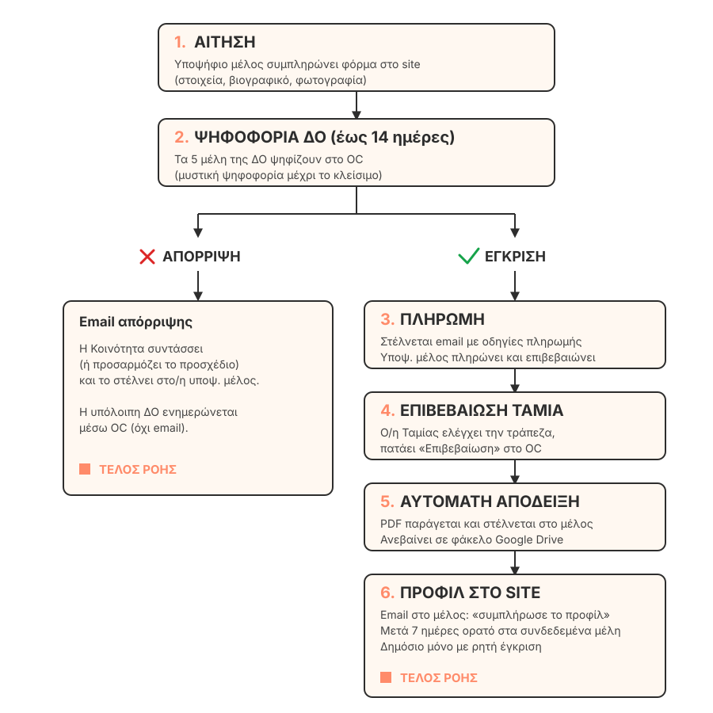

# Διαδικασία Εγγραφής Νέου Μέλους

**Operational Center (OC) — Επιχειρησιακό Κέντρο Διοικητικής Ομάδας**

> Έκδοση 1.0 · Σχέδιο προς υλοποίηση · Τελευταία ενημέρωση: Ιούνιος 2026

---

## Σε μία σελίδα

### Τι είναι το OC
Το **Operational Center (OC)** είναι το νέο εσωτερικό περιβάλλον (back office) της ιστοσελίδας του Culture for Change, σχεδιασμένο αποκλειστικά για τα μέλη της Διοικητικής Ομάδας. Σκοπός του είναι να αντικαταστήσει τα Excel, τα διπλά emails και τις χειροκίνητες διαδικασίες με ένα ενιαίο, αυτοματοποιημένο σύστημα.

### Πώς εγγράφεται ένα νέο μέλος — απλά βήματα

### Τι κερδίζουμε

| Τώρα | Με το OC |
|---|---|
| Πληροφορίες σε Excel, χειροκίνητα | Όλα αυτόματα στη βάση δεδομένων |
| Έγκριση σε φυσική συνάντηση | Ασύγχρονη ψηφοφορία στο OC |
| Πολλά emails μεταξύ της ΔΟ | Όλα φαίνονται στο OC, καμία αλληλογραφία |
| Χειροκίνητη απόδειξη + Drive | Αυτόματη παραγωγή PDF & αρχειοθέτηση |
| ~3–5 ώρες δουλειάς ανά υποψήφιο | ~1 ώρα (κυρίως ψήφος + έλεγχος) |

### Βασικές αρχές

- **Μυστική ψηφοφορία** μέχρι να κλείσει — κανείς δεν επηρεάζεται από προηγούμενες ψήφους
- **Μέγιστο 14 ημέρες** από αίτηση μέχρι απόφαση της ΔΟ
- **Δικλείδα ασφαλείας:** ο/η Συντονιστής/-τρια μπορεί να παρακάμψει χειροκίνητα οποιαδήποτε ψηφοφορία (με αιτιολόγηση, όλα καταγράφονται)
- **Καμία αυτόματη δημοσιοποίηση** προφίλ στο διαδίκτυο χωρίς ρητή έγκριση

---

## Αναλυτικά

### 1. Ρόλοι και δικαιώματα ψήφου

Η Διοικητική Ομάδα (ΔΟ) έχει **7 ρόλους**:

| Ρόλος | Πρόσβαση στο OC | Δικαίωμα ψήφου |
|---|---|---|
| Συντονιστής/-τρια | ✅ | ✅ (διπλό βάρος) |
| Κοινότητα | ✅ | ✅ |
| Επικοινωνία | ✅ | ✅ |
| Outreach (αναπληρωτής/-τρια Συντονιστή) | ✅ | ✅ |
| Ταμίας (Finance) | ✅ | ✅ |
| Γραμματεία (Admin Office) | ✅ | ❌ |
| IT | ✅ | ❌ |

**Σύνολο ψηφοφόρων: 5** — Γραμματεία και IT έχουν πρόσβαση στο OC αλλά δεν ψηφίζουν για εγγραφές μελών.

### 2. Διαδικασία ψηφοφορίας

**Πώς υπολογίζεται το αποτέλεσμα**

Κάθε ψήφος έχει βάρος. Ο/η Συντονιστής/-τρια έχει βάρος **2**, οι υπόλοιποι/-ες ψηφοφόροι έχουν βάρος **1**.

Συνολικό μέγιστο βάρος όταν ψηφίζουν και τα 5 μέλη: **6 πόντοι**.

**Κανόνας έγκρισης:** Βάρος ΝΑΙ > Βάρος ΟΧΙ.

Παραδείγματα:

| Σενάριο | ΝΑΙ | ΟΧΙ | Αποτέλεσμα |
|---|---|---|---|
| Όλοι ΝΑΙ | 6 | 0 | ✅ Έγκριση |
| 4 ψηφίζουν ΝΑΙ, Συντονιστής ΟΧΙ | 4 | 2 | ✅ Έγκριση |
| 3 ψηφίζουν ΝΑΙ, 1 ΟΧΙ, Συντονιστής ΝΑΙ | 5 | 1 | ✅ Έγκριση |
| 3 ψηφίζουν ΝΑΙ, 1 ΟΧΙ, Συντονιστής ΟΧΙ | 3 | 3 | ⚠️ Ισοψηφία |
| 2 ψηφίζουν ΝΑΙ, 2 ΟΧΙ, Συντονιστής ΟΧΙ | 2 | 4 | ❌ Απόρριψη |

**Μυστική ψηφοφορία**

Κανένας ψηφοφόρος δεν βλέπει τις ψήφους ή τα σχόλια των άλλων μέχρι να κλείσει η ψηφοφορία. Αυτό αποτρέπει την επιρροή από προηγούμενες ψήφους.

Η ψηφοφορία κλείνει όταν συμβεί ένα από τα παρακάτω:
- Επιτυγχάνεται έγκριση ή απόρριψη με βάση τα βάρη
- Ψηφίσουν όλοι/-ες οι ενεργοί/-ές ψηφοφόροι
- Συμπληρωθούν 14 ημέρες (σκληρό όριο)
- Φτάσουν 2 ψήφοι ΟΧΙ (μαθηματικά αδύνατη η έγκριση)

**Χρονοδιάγραμμα**

| Ημέρα | Συμβάν |
|---|---|
| 0 | Αίτηση υποβάλλεται· emails σε όλους τους ψηφοφόρους |
| 7 | Υπενθύμιση σε όσους/-ες δεν έχουν ψηφίσει ακόμη |
| 14 | Σκληρό όριο· αν δεν έχει ληφθεί απόφαση, ειδοποίηση στον/στην Συντονιστή/-τρια |

**Σε περίπτωση ισοψηφίας**

Η ψηφοφορία ανοίγει εκ νέου για **3 ημέρες**, με σκοπό να συζητήσει η ΔΟ και να επανατοποθετηθεί. Οι ψήφοι του πρώτου γύρου αρχειοθετούνται (στο ιστορικό audit log) και ο δεύτερος γύρος ξεκινά από την αρχή.

**Κατάσταση «Σε άδεια / Απουσία»**

Κάθε ψηφοφόρος έχει διακόπτη ενεργής/απουσίας στο OC. Όταν είναι σε απουσία:
- Δεν μετράται στους ενεργούς/-ές ψηφοφόρους
- Η ψηφοφορία συνεχίζεται με τους/τις υπόλοιπους/-ες (απαιτείται όμως **τουλάχιστον 3 ενεργοί/-ές ψηφοφόροι** για να ληφθεί απόφαση)
- Όταν ο/η Συντονιστής/-τρια είναι σε απουσία, ο/η Outreach κληρονομεί προσωρινά το διπλό βάρος

**Χειροκίνητη παράκαμψη**

Μόνο ο/η Συντονιστής/-τρια έχει τη δυνατότητα να εγκρίνει ή να απορρίψει χειροκίνητα μια αίτηση, παρακάμπτοντας τη ψηφοφορία. Υποχρεωτική αιτιολόγηση — όλα καταγράφονται.

### 3. Από την έγκριση στην πληρωμή

Μόλις εγκριθεί η αίτηση:

1. **Email στην/-ον υποψ. μέλος** με οδηγίες πληρωμής (IBAN, ποσό, στοιχεία αναφοράς). Το email συντάσσεται αυτόματα αλλά η Κοινότητα μπορεί:
   - να το στείλει ως έχει με ένα κλικ ("Αποστολή αυτόματου μηνύματος"), ή
   - να το επεξεργαστεί πρώτα ("Επεξεργασία & αποστολή")
2. Το email περιέχει ασφαλή σύνδεσμο: *«Πάτησε εδώ όταν ολοκληρώσεις τη συναλλαγή»*
3. Όταν το/η υποψ. μέλος πατήσει τον σύνδεσμο:
   - Βλέπει σελίδα: *«Ευχαριστούμε — ειδοποιήσαμε τον Ταμία μας. Θα λάβεις την απόδειξή σου εντός 1–3 εργάσιμων ημερών»*
   - Στέλνεται ειδοποίηση στον/στην Ταμία (και στην Κοινότητα για ενημέρωση)

**Ασφάλεια συνδέσμων**

Ο σύνδεσμος είναι **μοναδικός, υπογεγραμμένος, με χρόνο λήξης 24–48 ώρες**. Δεν δίνει πρόσβαση στον λογαριασμό — επιτρέπει μόνο τη συγκεκριμένη ενέργεια (δήλωση «πλήρωσα»).

### 4. Επιβεβαίωση Ταμία και απόδειξη

**Ροή Ταμία:**

1. Στο OC του/της Ταμία εμφανίζεται νέα αίτηση στην ενότητα «Εκκρεμείς πληρωμές»
2. Ο/η Ταμίας ελέγχει την τράπεζα
3. Αν το ποσό έχει εισπραχθεί, πατάει «Επιβεβαίωση πληρωμής» στο OC
4. **Αυτόματα γίνονται όλα τα παρακάτω:**
   - Παράγεται PDF απόδειξης με μοναδικό αύξοντα αριθμό
   - Στέλνεται στο νέο μέλος με συνημμένο PDF, **κοινοποίηση** στη Γραμματεία και την Κοινότητα
   - Το PDF ανεβαίνει στον φάκελο `/CforC-Members/Receipts/{Έτος}/` του οργανωτικού Google Drive
   - Ο/η Ταμίας λαμβάνει επιβεβαιωτικό email: *«Η απόδειξη #ΝΝΝ αποθηκεύτηκε στον φάκελο /CforC-Members/Receipts/2026/»*
   - Ενημερώνονται οι όψεις OC της Ταμία και της Κοινότητας

**Υπενθυμίσεις στον/στην Ταμία**

Αν περάσουν **2 ημέρες** χωρίς επιβεβαίωση από την αίτηση πληρωμής, ο/η Ταμίας λαμβάνει email υπενθύμισης.

### 5. Από την πληρωμή στο προφίλ

Μόλις επιβεβαιωθεί η πληρωμή, το νέο μέλος:

1. Λαμβάνει email καλωσορίσματος με σύνδεσμο που το/τη μεταφέρει στη σελίδα `/profile` για να συμπληρώσει βιογραφικό, φωτογραφία, πεδία πρακτικής, κ.λπ.
2. Το προφίλ ξεκινάει σε κατάσταση **«Κρυφό»** (`ACTIVE_HIDDEN`) — ορατό μόνο στο/στη νέο μέλος

**Μετά από 7 ημέρες:**

| Αν το μέλος έχει επεξεργαστεί το προφίλ | Παραμένει ορατό σε όλα τα συνδεδεμένα μέλη («Soft-publish»). Για να γίνει **δημόσιο**, πρέπει το ίδιο το μέλος να πατήσει «Κάνε δημόσιο» στο προφίλ του |
| --- | --- |
| **Αν το μέλος ΔΕΝ έχει επεξεργαστεί το προφίλ** | Το προφίλ γίνεται «Soft-published» (ορατό μόνο στα μέλη), και ταυτόχρονα η Επικοινωνία λαμβάνει email: *«Το προφίλ του/της Χ είναι έτοιμο για έλεγχο»*. Η Επικοινωνία επιλέγει: (α) Έγκριση ως έχει, (β) Επεξεργασία & έγκριση, (γ) Αναβολή |

**Αν η Επικοινωνία αναβάλει** ή δεν δράσει, το νέο μέλος λαμβάνει εβδομαδιαία ευγενική υπενθύμιση να συμπληρώσει το προφίλ του.

**Καμία αυτόματη δημοσιοποίηση χωρίς ανθρώπινη έγκριση.** Το προφίλ γίνεται δημόσιο μόνο εφόσον:
- Το ίδιο το μέλος πατήσει «Κάνε δημόσιο», ή
- Η Επικοινωνία πατήσει «Έγκριση & δημοσιοποίηση»

### 6. Σε περίπτωση απόρριψης

Αν η ψηφοφορία οδηγήσει σε απόρριψη:

1. Η αίτηση παίρνει την κατάσταση `REJECTED`
2. Στο OC της Κοινότητας εμφανίζεται προσχέδιο email με ευγενική απόρριψη — η Κοινότητα μπορεί:
   - Να το στείλει ως έχει, ή
   - Να το επεξεργαστεί πρώτα (π.χ. να προσθέσει αιτιολόγηση αν η ΔΟ αποφάσισε να τη μοιραστεί)
3. Τα υπόλοιπα μέλη της ΔΟ ενημερώνονται για την απόρριψη μέσω του OC (όχι email)

### 7. Καταγραφή και ιστορικό

Όλες οι ενέργειες καταγράφονται μόνιμα σε ιστορικό (audit log):

- Ποιος/-α ψήφισε τι και πότε
- Ποιος/-α έκανε χειροκίνητη παράκαμψη (και γιατί)
- Πότε επιβεβαιώθηκε η πληρωμή
- Πότε ανέβηκε η απόδειξη στο Drive
- Όλες οι αλλαγές κατάστασης

Το ιστορικό δεν διαγράφεται ποτέ — αποτελεί επίσημη τεκμηρίωση για κάθε υποψηφιότητα.

---

## Παράρτημα Α: Λίστα emails

Το σύστημα στέλνει αυτόματα τα παρακάτω μηνύματα. Όλα μπορούν να προσαρμοστούν από τη ΔΟ πριν τη λειτουργία.

**Προς υποψήφιο/-α & νέο μέλος (6):**

| # | Πότε | Περιεχόμενο |
|---|---|---|
| 1 | Αμέσως μετά την υποβολή της αίτησης | Επιβεβαίωση παραλαβής, προθεσμία 14 ημερών |
| 2 | Μετά από έγκριση | Καλωσόρισμα & οδηγίες πληρωμής (προσχέδιο, Κοινότητα στέλνει) |
| 3 | Μετά από απόρριψη | Προσχέδιο ευγενικής απόρριψης (Κοινότητα στέλνει) |
| 4 | Μετά την επιβεβαίωση Ταμία | Απόδειξη PDF, κοινοποίηση σε Γραμματεία + Κοινότητα |
| 5 | Αμέσως μετά το #4 | Καλωσόρισμα & σύνδεσμος για συμπλήρωση προφίλ |
| 6 | Εβδομαδιαία αν προφίλ ανεπεξέργαστο | Ευγενική υπενθύμιση από Επικοινωνία |

**Προς τη Διοικητική Ομάδα (6):**

| # | Πότε | Αποδέκτης |
|---|---|---|
| 7 | Νέα αίτηση υποβλήθηκε | Όλοι/-ες οι 5 ψηφοφόροι |
| 8 | Ημέρα 7 της ψηφοφορίας | Όσοι/-ες δεν έχουν ψηφίσει ακόμη |
| 9 | Υποψ. πάτησε «Πλήρωσα» | Ταμίας + Κοινότητα |
| 10 | 2 ημέρες μετά το #9 χωρίς επιβεβαίωση | Ταμίας |
| 11 | Απόδειξη ανέβηκε στο Drive | Ταμίας (επιβεβαίωση φακέλου) |
| 12 | Ημέρα 7 ανεπεξέργαστου προφίλ | Επικοινωνία (έλεγχος & δημοσιοποίηση) |

---

## Παράρτημα Β: Καταστάσεις αίτησης (state machine)

Κάθε αίτηση περνά από συγκεκριμένες καταστάσεις. Καμία αλλαγή δεν γίνεται αυτόματα χωρίς συγκεκριμένο γεγονός.

| Κατάσταση | Περιγραφή | Επόμενο βήμα ενεργοποιείται από |
|---|---|---|
| `PENDING_VOTES` | Σε ψηφοφορία | Επίτευξη πλειοψηφίας βάρους / λήξη χρόνου |
| `TIE` → `RE_VOTING` | Ισοψηφία, ανοιχτή για 3 ημέρες | Επανάληψη γύρου |
| `REJECTED` | Απορρίφθηκε | Τέλος ροής |
| `PENDING_PAYMENT` | Εγκεκριμένη, αναμονή πληρωμής | Υποψ. μέλος δηλώνει πληρωμή |
| `PENDING_FINANCE_CONFIRM` | Δήλωση πληρωμής, εκκρεμεί έλεγχος | Ταμίας επιβεβαιώνει |
| `ACTIVE_HIDDEN` | Κρυφό προφίλ (ημέρες 0–7) | Πέρασμα 7 ημερών ή χρήστης δημοσιεύει |
| `MEMBER_VISIBLE` | Ορατό σε μέλη, όχι δημόσιο | Επικοινωνία ή χρήστης κάνουν δημόσιο |
| `PUBLIC` | Πλήρως δημόσιο | Τέλος ροής |

---

## Παράρτημα Γ: Τι αλλάζει συνολικά για κάθε ρόλο

| Ρόλος | Τι έκανε πριν | Τι θα κάνει με το OC |
|---|---|---|
| **Συντονιστής/-τρια** | Συντόνιζε συναντήσεις ψηφοφορίας | Ψηφίζει στο OC· έχει δικαίωμα χειροκίνητης παράκαμψης |
| **Κοινότητα** | Συνέτασσε emails καλωσορίσματος/απόρριψης από την αρχή | Πατάει «Αποστολή» σε προσχέδια έτοιμα από το OC |
| **Επικοινωνία** | Πρόσθετε στοιχεία στο site για κάθε νέο μέλος | Εγκρίνει δημοσιοποίηση προφίλ μέσω OC |
| **Ταμίας** | Έλεγχε τράπεζα, έκανε PDF αποδείξεις χειροκίνητα, ενημέρωνε άλλους | Πατάει «Επιβεβαίωση»· τα υπόλοιπα γίνονται αυτόματα |
| **Outreach** | — | Ψηφίζει στο OC· αναπληρωτής/-τρια Συντονιστή |
| **Γραμματεία** | Διατηρούσε Excel, παρακολουθούσε αιτήσεις | Πρόσβαση στο OC για επισκόπηση και ιστορικό |
| **IT** | Πρόσθετε χειροκίνητα τα μέλη στη βάση | Πρόσβαση στο OC για τεχνική επισκόπηση· καμία χειροκίνητη ενέργεια |

---

*Το παρόν έγγραφο αποτελεί τεκμηρίωση σχεδιασμού. Η υλοποίηση θα γίνει σε φάσεις:*

- **Φάση 1α** — Φόρμα αίτησης + ψηφοφορία στο OC (~2 εβδομάδες)
- **Φάση 1β** — Ροή πληρωμής + αυτόματη απόδειξη PDF (~1.5 εβδομάδα)
- **Φάση 1γ** — Ολοκλήρωση Google Drive + soft-publish + έλεγχος Επικοινωνίας (~2 εβδομάδες)
