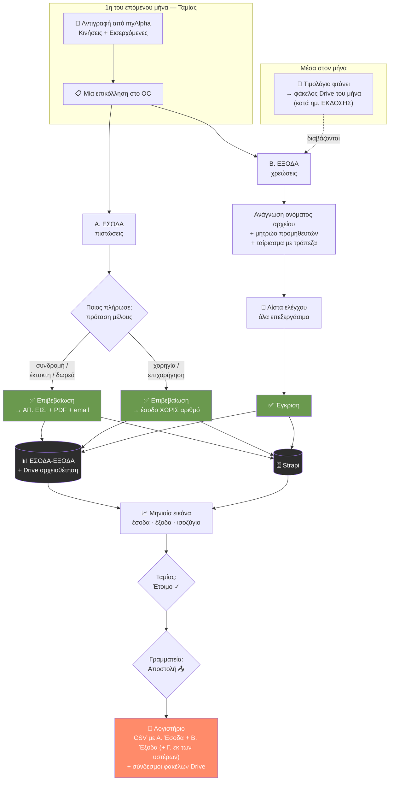
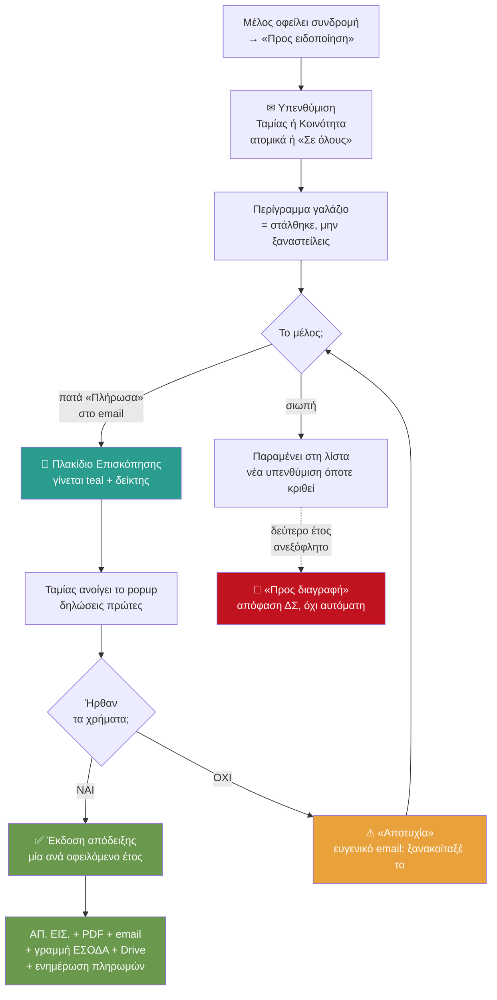

# OC — Οικονομικά, Διαχείριση, Επικοινωνία & Δείκτες

*Κατάσταση: 18 Αυγούστου 2026 · Συστήματα: Ιστοσελίδα (Next.js/Vercel) · Strapi Cloud · ΕΣΟΔΑ-ΕΞΟΔΑ Google Sheet (Apps Script) · Google Drive «Παραστατικά» · Google Calendar · Google Docs · Google Analytics 4 · Sender · Resend (email)*

> Συμπληρωματικό του [Membership-Lifecycle-Processes.md](Membership-Lifecycle-Processes.md), που καλύπτει τον κύκλο ζωής του μέλους. Εδώ περιγράφεται τι κάνει το OC με τα **χρήματα**, το **ημερολόγιο**, τις **εκκρεμότητες**, την **επικοινωνία** και τους **δείκτες**.
>
> Το κείμενο περιγράφει **ό,τι υπάρχει σήμερα**. Ό,τι είναι σχεδιασμένο αλλά δεν έχει υλοποιηθεί σημειώνεται ρητά ως «δεν υπάρχει ακόμη».
>
> **Κάθε ρόλος προσγειώνεται στο δικό του τμήμα:** Ταμίας → Οικονομικά · Γραμματεία/IT → Διαχείριση · Επικοινωνία → Επικοινωνία. Δεν χρειάζεται να ψάξει κανείς πού δουλεύει.

---

## Σελίδα 0 — Για μη τεχνικούς: τι κάνει το σύστημα με τα χρήματα

Φαντάσου ότι είσαι το νέο Ταμείο του CforC και ανοίγεις το OC την 1η του μήνα. Να τι θα συμβεί.

**1. Κατεβάζεις τις κινήσεις της τράπεζας.** Μπαίνεις στο myAlpha Web, επιλέγεις τον μήνα και **αντιγράφεις** δύο λίστες: τις «Κινήσεις» και τις «Εισερχόμενες εντολές». Δεν χρειάζεται αρχείο, ούτε σύνδεση με την τράπεζα — απλή αντιγραφή-επικόλληση.

**2. Τις επικολλάς μία φορά, στο OC.** Στα Οικονομικά υπάρχει η κάρτα «Αναφορά Εσόδων/Εξόδων». Επικολλάς εκεί τα δύο κείμενα. Η **ίδια** επικόλληση εξυπηρετεί και τα έσοδα και τα έξοδα — δεν τη δίνεις δύο φορές.

**3. Το σύστημα σού δείχνει ποιος πλήρωσε.** Για κάθε είσπραξη σου προτείνει σε ποιο μέλος αντιστοιχεί, διαβάζοντας το όνομα του καταθέτη — ακόμη κι όταν η τράπεζα το γράφει με λατινικούς χαρακτήρες («GEORGIOS PAPADOPOULOS» → Γιώργος Παπαδόπουλος). **Δεν εκδίδει τίποτα μόνο του.** Εσύ επιβεβαιώνεις κάθε γραμμή. Κάθε φορά που επιβεβαιώνεις, το σύστημα το θυμάται: την επόμενη φορά ο ίδιος καταθέτης αναγνωρίζεται αμέσως.

**4. Πατάς «Έκδοση».** Για κάθε επιβεβαιωμένη γραμμή γίνονται αυτόματα τέσσερα πράγματα: παίρνει τον **επόμενο αριθμό ΑΠ. ΕΙΣ.**, φτιάχνεται η **απόδειξη σε PDF**, στέλνεται **email στο μέλος**, και γράφεται η **γραμμή στο ΕΣΟΔΑ** με το PDF αρχειοθετημένο στον φάκελο του μήνα στο Drive. Καμία χειροκίνητη καταχώρηση.

**5. Τα τιμολόγια των εξόδων.** Όποτε έρχεται ένα τιμολόγιο μέσα στον μήνα, το ρίχνεις στον φάκελο του μήνα στο Drive — **με βάση την ημερομηνία έκδοσής του**, όχι πληρωμής. Το όνομα του αρχείου έχει σημασία: γράψε μέσα του τον προμηθευτή, τον αριθμό παραστατικού, την ημερομηνία και το ποσό. Στο τέλος του μήνα πατάς «Έλεγχος τιμολογίων» και το σύστημα τα διαβάζει όλα, τα αντιστοιχεί με τις χρεώσεις της τράπεζας, και σου τα παρουσιάζει σαν λίστα ελέγχου για να τα εγκρίνεις — ένα-ένα ή όλα μαζί.

**6. Η μηνιαία εικόνα.** Μία κάρτα δείχνει όλα τα έσοδα και όλα τα έξοδα του μήνα, με σύνολα και ισοζύγιο. Όταν είσαι σίγουρη, πατάς «Έτοιμο προς αποστολή στο λογιστήριο». Μετά — και **μόνο** μετά — η Γραμματεία μπορεί να πατήσει «Αποστολή» και το αρχείο φεύγει με email στο λογιστικό γραφείο.

**Τρία πράγματα να θυμάσαι:**

- **Τίποτα δεν στέλνεται και τίποτα δεν εκδίδεται χωρίς να το πατήσεις εσύ.** Το σύστημα προτείνει· εσύ αποφασίζεις.
- **Η αρίθμηση των αποδείξεων ανήκει στο OC.** Ποτέ μη γράψεις αριθμό ΑΠ. ΕΙΣ. με το χέρι στο Excel — θα δημιουργηθεί διπλός αριθμός και το μπέρδεμα δεν ξεμπερδεύεται εύκολα.
- **Το Excel παραμένει.** Το OC δεν το αντικατέστησε· το γράφει. Ό,τι βλέπεις στην οθόνη υπάρχει και στο φύλλο, με το ίδιο Α/Α.

---

## Σελίδα 1 — Το διάγραμμα της ροής



**Η μία γραμμή που εξηγεί τα πάντα:** η τράπεζα λέει *πόσα και πότε*, το όνομα του αρχείου λέει *τι και από ποιον*, το OC δίνει *τον αριθμό*, και ο άνθρωπος δίνει *την έγκριση*. Κανένα από τα τέσσερα δεν κάνει τη δουλειά του άλλου.

---

## Σελίδα 2 — Σύνοψη ανά ρόλο

| Ενέργεια | Ταμίας | Γραμματεία / IT | Κοινότητα | Υπόλοιπο ΔΣ |
|---|:--:|:--:|:--:|:--:|
| Προβολή Οικονομικών | ✅ | ✅ | ✅ | ✅ |
| Έκδοση απόδειξης | ✅ | — | — | — |
| Καταχώρηση εσόδου χωρίς απόδειξη | ✅ | — | — | — |
| Έγκριση εξόδων | ✅ | — | — | — |
| Υπενθύμιση συνδρομής | ✅ | — | ✅ | — |
| «Έτοιμο προς αποστολή» | ✅ | — | — | — |
| **Αποστολή στο λογιστήριο** | — | ✅ | — | — |
| Δημιουργία ετήσιων φακέλων | ✅ | — | — | — |
| Ενημέρωση Ταμείου | ✅ | — | — | — |
| Εγγραφή στο ημερολόγιο | — | ✅ | — | ✅ Επικοινωνία |
| Καταγραφή παρουσιών | ✅ | ✅ | ✅ | ✅ |
| Εκκρεμότητες (δημιουργία, τικ) | ✅ | ✅ | ✅ | ✅ |
| Προβολή Δεικτών | ✅ | ✅ | ✅ | ✅ |

Η **διπλή υπογραφή** στο κλείσιμο του μήνα είναι σκόπιμη: αυτός που ελέγχει τα νούμερα δεν είναι αυτός που τα στέλνει έξω.

---

## Σελίδα 2β — Η Επισκόπηση: η ουρά εργασίας του Ταμείου

Η **Επισκόπηση** είναι η πρώτη οθόνη που βλέπει κάθε μέλος του ΔΣ. Για τους περισσότερους ρόλους είναι ενημερωτική. Για τον/την **Ταμία** είναι κάτι άλλο: είναι η **λίστα του τι περιμένει**. Η λογική είναι ότι δεν πρέπει να χρειάζεται να θυμάσαι τίποτα απ' έξω — αν κάτι σε αφορά, ανάβει μόνο του.

### Τα έξι πλακίδια

| Πλακίδιο | Τι δείχνει | Κλικ; |
|---|---|:--:|
| **Ενεργά μέλη** | πόσα μέλη έχει το δίκτυο | — |
| **Πληρωμένο {έτος}** | π.χ. 42/58 — πόσοι έχουν τακτοποιηθεί | ✅ |
| **Εκκρεμείς αιτήσεις** | αιτήσεις που περιμένουν ψήφο | — |
| **Εγκρίθηκαν — αναμονή πληρωμής** | ενέκρινε το ΔΣ, δεν ήρθαν χρήματα | ✅ |
| **Νέα μέλη {έτος}** | πόσοι μπήκαν φέτος | — |
| **Ταμείο** | *placeholder* — δεν υπολογίζεται ακόμη | — |

### Το teal σήμα: «κάποιος δήλωσε ότι πλήρωσε»

Δύο από τα πλακίδια είναι **κουμπιά** και αλλάζουν όψη όταν υπάρχει δουλειά. Όταν κάποιος πατήσει τον σύνδεσμο «Έκανα την κατάθεση» από το email του, το πλακίδιο γίνεται **τιρκουάζ** και αποκτά έναν **δείκτη με τον αριθμό** των δηλώσεων. Δεν είναι διακοσμητικό — είναι ουρά εργασίας:

- **Πληρωμένο {έτος}** → ανανεώσεις συνδρομών υπαρχόντων μελών
- **Εγκρίθηκαν — αναμονή πληρωμής** → νέα μέλη που περιμένουν την πρώτη τους απόδειξη

Το κλικ ανοίγει popup με **πρώτους όσους δήλωσαν πληρωμή**, και εκεί ο/η Ταμίας κάνει τη δουλειά επιτόπου, χωρίς να φύγει από την οθόνη.

### Οι δύο λίστες παρακολούθησης

Χαμηλότερα, δύο ομάδες ονομάτων:

- **Προς ειδοποίηση** (πορτοκαλί) — οφείλουν το τρέχον έτος
- **Προς διαγραφή** (κόκκινο) — δύο έτη ανεξόφλητα, το καταστατικό προβλέπει διαγραφή

Στην Επισκόπηση είναι **μόνο για ανάγνωση**. Οι ίδιες λίστες, με τα κουμπιά υπενθύμισης, βρίσκονται στα **Οικονομικά** (κάρτα Συνδρομών) — σκόπιμος διαχωρισμός: η Επισκόπηση λέει *τι συμβαίνει*, τα Οικονομικά είναι όπου *ενεργείς*.

---

## Σελίδα 2γ — Τι μπορεί ΜΟΝΟ ο/η Ταμίας

Επτά ενέργειες σε όλο το OC απαιτούν τον **ενεργό ρόλο Ταμία**. «Ενεργό» σημαίνει ότι, αν κρατάς δύο θέσεις, πρέπει να έχεις επιλέξει αυτήν του Ταμείου κατά την είσοδο — το OC θυμάται την τελευταία επιλογή. Ο έλεγχος γίνεται **στον server** σε κάθε αίτημα, όχι μόνο με κρύψιμο του κουμπιού.

| # | Ενέργεια | Πού | Τι προκαλεί — μη αναστρέψιμο |
|---|---|---|---|
| 1 | **Έκδοση απόδειξης** | Οικονομικά · popup Επισκόπησης | καίγεται αριθμός ΑΠ. ΕΙΣ., φεύγει email |
| 2 | **Καταχώρηση εσόδου χωρίς απόδειξη** | Α. Έσοδα | γραμμή στο ΕΣΟΔΑ |
| 3 | **Έγκριση εξόδων** | Β. Έξοδα | γραμμές ΕΞΟΔΑ + μετονομασία αρχείων |
| 4 | **Δήλωση «Αποτυχία πληρωμής»** | popup ανανεώσεων | email στο μέλος |
| 5 | **«Έτοιμο προς αποστολή»** | Μηνιαία εικόνα | ξεκλειδώνει τη Γραμματεία |
| 6 | **Σήμανση ημ. αποστολής** | λίστα αποδείξεων | διορθώνει το ιστορικό |
| 7 | **Δημιουργία ετήσιων φακέλων** | banner «Καλή Χρονιά» | φάκελοι στο Drive |
| 8 | **Ενημέρωση Ταμείου** | πλακίδιο Επισκόπησης | νέα μέτρηση υπολοίπου |

**Μοιράζεται με την Κοινότητα:** οι υπενθυμίσεις συνδρομής (ατομικές και μαζικές) — είναι επικοινωνία με τα μέλη, όχι οικονομική πράξη.
**Ανήκει στη Γραμματεία/IT:** η τελική **αποστολή στο λογιστήριο**. Ο Ταμίας εγκρίνει, δεν αποστέλλει.

### Ο κύκλος της ανανέωσης — αναλυτικά



**Τέσσερα σημεία που αξίζει να προσέξεις:**

**Η δήλωση δεν είναι πληρωμή.** Το «Πλήρωσα» του μέλους ανάβει μια ένδειξη· δεν εκδίδει τίποτα. Ο/η Ταμίας ελέγχει τον λογαριασμό και αποφασίζει. Γι' αυτό υπάρχει και η διαδρομή «Αποτυχία» — οι τράπεζες καθυστερούν και απορρίπτουν μεταφορές, και το μέλος πρέπει να το μάθει ευγενικά αντί να μείνει σε εκκρεμότητα.

**Μία απόδειξη ανά έτος.** Αν κάποιος οφείλει 2025 και 2026 και τα πληρώσει μαζί, εκδίδονται **δύο** αποδείξεις — μία για κάθε έτος, με χωριστούς αριθμούς. Το λογιστήριο θέλει το έσοδο στη χρονιά που αφορά.

**Το περίγραμμα είναι μνήμη.** Μόλις σταλεί υπενθύμιση, το όνομα αποκτά μόνιμο γαλάζιο περίγραμμα με την ημερομηνία (`ReminderSentAt`). Η επόμενη Ταμίας βλέπει τι έχει ήδη γίνει, χωρίς να ρωτήσει κανέναν.

**Η διαγραφή δεν είναι αυτόματη.** Η κόκκινη λίστα *προτείνει*· η απόφαση είναι του ΔΣ και η εκτέλεση χειροκίνητη. Καμία ιδιότητα μέλους δεν χάνεται από χρονόμετρο.

---

## Σελίδα 3 — Αναλυτικά

### 3.1 Η σειρά αποδείξεων ΑΠ. ΕΙΣ.

**Μία σειρά, μία αρχή.** Υπάρχει ένας ενιαίος αύξων αριθμός για κάθε είσπραξη, ανεξάρτητα από το είδος της. Η σειρά συνεχίζει από το **364**, τον τελευταίο χειρόγραφο αριθμό πριν την αυτοματοποίηση (Μ. Κιτσέλλης, 14/7/2026).

**Το OC είναι η μοναδική αρχή αρίθμησης.** Στη βάση, το πεδίο `Number` είναι υποχρεωτικό και μοναδικό — απόδειξη χωρίς αριθμό είναι αδύνατη, και δύο αποδείξεις με τον ίδιο αριθμό επίσης. Αν δύο άνθρωποι πατήσουν έκδοση ταυτόχρονα, η βάση απορρίπτει τον δεύτερο και το σύστημα ξαναρωτά για τον επόμενο ελεύθερο αριθμό.

**Δύο αριθμοί, όχι ένας.** Κάθε είσπραξη έχει:

- **ΑΠ. ΕΙΣ.** — ο νομικός αύξων αριθμός της απόδειξης, τρέχει συνεχόμενα όλο τον χρόνο (365, 366, 367…).
- **Α/Α** — η θέση της γραμμής μέσα στον μήνα του φύλλου (9.1, 9.2, 9.3…). Είναι ο αριθμός με τον οποίο μιλάει το λογιστήριο, και δίνεται από το **φύλλο**, όχι από το OC.

Τα δύο δεν συμβαδίζουν: μια χορηγία παίρνει Α/Α αλλά **όχι** ΑΠ. ΕΙΣ.

**Πότε εκδίδεται απόδειξη — και πότε όχι.** Συνδρομές, εγγραφές, έκτακτες εισφορές και δωρεές παίρνουν απόδειξη. Χορηγίες και επιχορηγήσεις **δεν** παίρνουν: καταχωρούνται ως «έσοδο χωρίς απόδειξη» με την αναφορά της τράπεζας ως παραστατικό. Γι' αυτό υπάρχει χωριστή συλλογή (`income-record`) αντί να γίνει ο αριθμός προαιρετικός στις αποδείξεις.

### 3.2 Η μηνιαία επικόλληση της τράπεζας

Η Alpha Bank δεν δίνει αρχείο προς λήψη με τη μορφή που χρειαζόμαστε — μόνο αντιγραφή από την οθόνη. Χρειάζονται **δύο** αντιγραφές, γιατί η κάθε μία κρύβει κάτι που έχει η άλλη:

| Λίστα | Τι δίνει | Παγίδα |
|---|---|---|
| **Κινήσεις** | ποσό, υπόλοιπο, αιτιολογία, Αρ. Συναλλαγής | ημερομηνία **ΗΗ/ΜΜ** |
| **Εισερχόμενες εντολές** | **το όνομα του καταθέτη** και την τράπεζά του | ημερομηνία **ΜΜ/ΗΗ** |

Οι δύο λίστες ενώνονται στον **Αρ. Συναλλαγής**. Οι δύο διαφορετικές μορφές ημερομηνίας δεν είναι λάθος μας — έτσι τις δίνει η τράπεζα, και ο parser τις χειρίζεται χωριστά.

Ως έλεγχος πληρότητας χρησιμοποιείται η **αριθμητική των υπολοίπων**: αν το υπόλοιπο κάθε γραμμής δεν προκύπτει από το προηγούμενο συν την κίνηση, λείπει κάτι από την επικόλληση και εμφανίζεται προειδοποίηση.

### 3.3 Πώς αναγνωρίζεται το μέλος

Η τράπεζα γράφει τα ονόματα με λατινικούς χαρακτήρες και σε τυχαία σειρά. Ο matcher κάνει μεταγραφή greeklish→ελληνικά και συγκρίνει με το μητρώο.

**Δύο κανόνες ασφαλείας, γραμμένοι μετά από πραγματική παρ' ολίγον αστοχία:**

1. Η **ΕΘΝΙΚΗ** γεμίζει τρεις στήλες — επώνυμο, όνομα, **πατρώνυμο**. Το πατρώνυμο αφαιρείται πριν τη σύγκριση.
2. Όταν το όνομα του μέλους έχει δύο λέξεις, πρέπει να ταιριάξουν **δύο** ισχυρά, όχι μία.

Χωρίς αυτούς, το «VLACHOS NIKOLAOS **GEORGIOS**» προτεινόταν ως η μέλος «**Γεωργί**α Γεωργίου» — επειδή ταίριαζε το πατρώνυμο με το επώνυμό της. Ένα κλικ από απόδειξη σε λάθος άνθρωπο.

**Το σύστημα μαθαίνει.** Κάθε επιβεβαίωση αποθηκεύεται ως αντιστοίχιση «όνομα καταθέτη → μέλος» (`payer-alias`). Την επόμενη φορά η πρόταση είναι άμεση και βέβαιη. ⚠ Μια λανθασμένη επιβεβαίωση μαθαίνεται εξίσου καλά — αν γίνει λάθος, η αντιστοίχιση πρέπει να διαγραφεί από το Strapi.

### 3.4 Τα έξοδα — γιατί χωρίς τεχνητή νοημοσύνη

Τα τιμολόγια **δεν διαβάζονται** από AI. Διαβάζεται μόνο **το όνομα του αρχείου**, με κανόνες. Η επιλογή είναι συνειδητή: το όνομα το ελέγχεις εσύ, το αποτέλεσμα είναι προβλέψιμο, δεν στέλνεται τίποτα σε τρίτους, και δεν πληρώνουμε τίποτα.

**Τι αναγνωρίζεται στο όνομα:**

| Στοιχείο | Μορφή | Παράδειγμα |
|---|---|---|
| ΜΑΡΚ | 15 ψηφία που αρχίζουν με 4000 | `400014700880013` |
| Αριθμός παραστατικού | οτιδήποτε άλλο μοιάζει με κωδικό | `4471-88012` |
| Ημερομηνία | έξι μορφές, με `-` `.` `/` ή `_` | `28-08-2026`, `3_3_26` |
| Ποσό | με κόμμα και **δύο** δεκαδικά, ή με € | `62,50` · `2500€` · `16.20€` |

Το **ποσό** έχει τον αυστηρότερο κανόνα, επίτηδες: χωρίς σύμβολο νομίσματος απαιτούνται κόμμα και ακριβώς δύο δεκαδικά, ώστε το «1.234» ενός αριθμού παραστατικού να μη διαβαστεί ποτέ ως 1.234 €. Αν το ποσό δεν αναγνωριστεί, δεν χάνεται τίποτα — έρχεται από την τράπεζα.

**Το μητρώο προμηθευτών** (`supplier-alias`) συμπληρώνει επωνυμία, ΑΦΜ και κατηγορία: το δηλώνεις μία φορά και θυμάται. Έχει και σημαία «αυτόματη χρέωση» για προμηθευτές σαν την τράπεζα, όπου η πληρωμή γίνεται την ίδια μέρα με την έκδοση.

**Τρία περάσματα ταιριάσματος** με τις χρεώσεις: με το ποσό, με το όνομα του προμηθευτή μέσα στην αιτιολογία, και με ανεξόφλητα παραστατικά προηγούμενων μηνών.

**Πριν την επικόλληση** — μόλις διαλέξεις μήνα αναφοράς, η κάρτα δείχνει τη λίστα «Ανεξόφλητα από προηγούμενους μήνες» (εγκεκριμένα παραστατικά χωρίς πληρωμή): ξέρεις τι να ψάξεις στις κινήσεις. Μετά την Ανάλυση εξόδων, όσα βρέθηκαν παίρνουν ✓ και πάνε ως «Εξοφλήσεις παλαιότερων» — στην αποστολή του τρέχοντος μήνα (τμήμα Γ).

**Τι σε προειδοποιεί:**

- «ασυμφωνία ποσού» — το όνομα λέει άλλο ποσό από την τράπεζα
- «ανεξόφλητο» — παραστατικό χωρίς αντίστοιχη χρέωση
- «χωρίς κατηγορία» — δεν θα συμπληρωθεί η στήλη ΚΑΤΗΓΟΡΙΑ
- «Συμφωνία μήνα» — σύνολο χρεώσεων τράπεζας έναντι συνόλου παραστατικών

**Παραστατικό Σεπτεμβρίου που πληρώνεται Οκτώβριο** μένει στον Σεπτέμβριο (εκεί εκδόθηκε) και εμφανίζεται τον Οκτώβριο ως εκκρεμότητα προς εξόφληση. Ο μήνας ενός εξόδου καθορίζεται από την **ημερομηνία έκδοσης**, ποτέ από την πληρωμή.

### 3.5 Η ενιαία ονοματοδοσία

Μετά την έγκριση, **κάθε** αρχείο —τιμολόγιο, έγγραφο χορηγίας, PDF απόδειξης— μετονομάζεται στην ίδια μορφή:

```
Α/Α_σε ποιον αφορά_αριθμός παραστατικού_ΜΑΡΚ_ΗΗ-ΜΜ-ΕΕΕΕ_ποσό.pdf

9.4_ΑΒ Βασιλόπουλος_4471-88012_400014700880013_28-08-2026_62,50.pdf
9.2_Εκείνος Θέλει_ΑΠ. ΕΙΣ. 365_17-08-2026_35,00.pdf
```

Ό,τι λείπει παραλείπεται χωρίς κενά. Το όνομα χτίζεται από τα **πεδία της εγκεκριμένης εγγραφής**, όχι από το πρόχειρο όνομα που ανέβασες — γι' αυτό δεν εμφανίζονται διπλές ημερομηνίες. Το κέρδος: βλέποντας μια γραμμή του Excel ξέρεις ακριβώς ποιο αρχείο τη συνοδεύει, και αντίστροφα.

### 3.6 Η μηνιαία εικόνα και το κλείσιμο

Η κάρτα δείχνει τρία κουτιά — **Έσοδα · Έξοδα · Ισοζύγιο** — και δύο τμήματα:

- **Α. Έσοδα** — αποδείξεις κατά **ημερομηνία πληρωμής** (η τραπεζική, όχι η έκδοσης — έτσι το θέλει το λογιστήριο) μαζί με τα έσοδα χωρίς απόδειξη.
- **Β. Έξοδα** — τα εγκεκριμένα παραστατικά του **μπλοκ του μήνα** στο ΕΞΟΔΑ.
- **Γ. Εκ των υστέρων** — εμφανίζεται μόνο όταν υπάρχει κάτι: στοιχεία για **μήνες που έχουν ήδη σταλεί** και προέκυψαν μετά. Δύο είδη: **εξόφληση** (παραστατικό παλαιότερου μήνα που πληρώθηκε μέσα σε αυτόν τον μήνα) και **νέα καταχώρηση** (παραστατικό παλαιότερου μήνα που εγκρίθηκε αφού είχε σταλεί ο μήνας του). Ορίζονται καθαρά από τα δεδομένα — ημερομηνία πληρωμής, ημερομηνία έγκρισης, ημερομηνία αποστολής — ώστε κάθε στοιχείο να φύγει **ακριβώς μία** φορά, με την πρώτη αποστολή που ακολουθεί. Η γραμμή μένει στον μήνα έκδοσής της, ως η **τελευταία** του (Α/Α σε συνέχεια), όποια κι αν είναι η ημερομηνία του παραστατικού.

Όλα ταξινομούνται κατά Α/Α, με σωστή σειρά στα διψήφια (9.10 μετά το 9.2 — είναι μήνας.σειρά, όχι δεκαδικός).

**Το κλείσιμο γίνεται σε δύο στάδια:** ο/η Ταμίας πατά «Έτοιμο προς αποστολή», και μόνο τότε ενεργοποιείται για τη Γραμματεία το «Αποστολή στο λογιστήριο». Φεύγει email με **CSV** που έχει τμήμα Α, τμήμα Β, (Γ αν υπάρχει), σύνολα και ισοζύγιο, και με **απευθείας συνδέσμους** στους φακέλους Drive του μήνα (Έξοδα και Έσοδα — όσους επιστρέψει το web app). Παραλήπτης το `ACCOUNTANT_EMAIL`, με κοινοποίηση finance@ και hello@.

**Δέλτα.** Αν καταχωρηθεί απόδειξη σε μήνα που έχει ήδη σταλεί, σημαίνεται κόκκινη ως «δέλτα» και μετριέται χωριστά. Ο κανόνας: μια αλλαγή σε κλεισμένο μήνα δεν επιτρέπεται να περάσει σιωπηλά.

### 3.7 Υπενθυμίσεις συνδρομών

Στην Επισκόπηση υπάρχουν bubbles «Προς ειδοποίηση» και «Προς διαγραφή». Από εκεί στέλνονται υπενθυμίσεις — σε ένα μέλος ή σε όλα διαδοχικά. Το email περιέχει **σύνδεσμο δήλωσης πληρωμής**: το μέλος δηλώνει ότι πλήρωσε, η δήλωση εμφανίζεται στον/στην Ταμία, και με την έγκριση εκδίδεται αυτόματα η απόδειξη. Το περίγραμμα του μέλους αλλάζει χρώμα όταν έχει σταλεί υπενθύμιση, ώστε να μη σταλεί δύο φορές.

Επιτρέπεται σε **Ταμία και Κοινότητα** — για τους υπόλοιπους ρόλους το κουμπί είναι ανενεργό.

> **Δεν υπάρχει ακόμη:** οι **αυτόματες** υπενθυμίσεις στις 15 / 28 / 30 ημέρες. Σήμερα κάθε υπενθύμιση στέλνεται με το χέρι από τα bubbles. Η προδιαγραφή είναι στο §4α του Membership-Lifecycle-Processes.md και απαιτεί προγραμματισμένη εκτέλεση (Vercel Cron).

### 3.10 Ταμείο

Το υπόλοιπο **δεν υπολογίζεται** από τις κινήσεις: το διαβάζει ο/η Ταμίας από την τράπεζα και το καταχωρεί. Κάθε μέτρηση κρατιέται — δεν πατάει την προηγούμενη — ώστε το πλακίδιο να δείχνει και πορεία, όχι μόνο σημείο.

Το πλακίδιο «Ταμείο» στην Επισκόπηση γίνεται **κεχριμπαρένιο** όταν λείπει μέτρηση του τρέχοντος μήνα, και το ίδιο μήνυμα εμφανίζεται στα Οικονομικά. **Την 1η κάθε μήνα** φεύγει email υπενθύμισης στον/στην τρέχοντα Ταμία, μέσα από το ΥΠΑΡΧΟΝ cron της μηνιαίας αναφοράς — όχι δεύτερο προγραμματισμένο job, γιατί το Vercel τα περιορίζει.

### 3.8 Η δομή του Drive

```
Παραστατικά/
└── 2026/
    ├── Έσοδα 2026/    01_Ιανουάριος … 12_Δεκέμβριος
    ├── Έξοδα 2026/    01_Ιανουάριος … 12_Δεκέμβριος
    └── Παράβολα 2026/
```

Τον Ιανουάριο–Φεβρουάριο, αν λείπει η δομή του νέου έτους, εμφανίζεται banner «Καλή Χρονιά» που τη δημιουργεί με ένα κλικ — **ποτέ αυτόματα**.

### 3.9 Όταν κάτι σπάσει

Ο κρίκος που σπάει πιο εύκολα είναι η σύνδεση με το Apps Script. Η κλασική παγίδα: δημοσίευση **νέου deployment** αντί για **νέα έκδοση** του υπάρχοντος — φτιάχνεται καινούργια διεύθυνση και το site συνεχίζει να μιλά στην παλιά, εκτελώντας παλιό κώδικα χωρίς κανένα σφάλμα.

Γι' αυτό υπάρχουν δύο εργαλεία:

- **Ένδειξη σύνδεσης** στα Οικονομικά: πορτοκαλί μπάνερ μόνο όταν κάτι δεν πάει καλά, με διάγνωση («δεν έχει ρυθμιστεί» / «λάθος μυστικό» / «δεν απαντά») και κουμπί Επανέλεγχος. Ορατό μόνο στον/στην Ταμία.
- **Ενέργεια `ping`** στο script, που επιστρέφει την έκδοση που *πράγματι* εκτελείται και τους αριθμούς στηλών που γράφει — ώστε να μη μαντεύει κανείς αν πέρασε το deployment.

**Σωστή διαδικασία ενημέρωσης του script:** επικόλληση → Save → **Manage deployments → μολύβι (Edit) → Version: New version → Deploy**. Ποτέ «New deployment».

---

## Σελίδα 4 — Πού ζει τι

| Δεδομένο | Πηγή αλήθειας | Καθρέφτης |
|---|---|---|
| Αποδείξεις, αριθμοί, ποσά | Strapi `receipt` | ΕΣΟΔΑ (γραμμή + Α/Α) |
| Έσοδα χωρίς απόδειξη | Strapi `income-record` | ΕΣΟΔΑ |
| Έξοδα | Strapi `expense` | ΕΞΟΔΑ |
| Αρχεία PDF | Google Drive | — |
| Κλείσιμο μήνα | Strapi `monthly-close` | email λογιστηρίου |
| Μαθημένες αντιστοιχίσεις | Strapi `payer-alias`, `supplier-alias` | — |
| Ταμείο (μετρήσεις) | Strapi `treasury-balance` | — |
| Εκκρεμότητες | Strapi `oc-task-board`, `oc-task` | — |
| Παρουσίες σε δράσεις | Strapi `event-attendance` | — |
| Ημερολόγιο δράσεων | **Google Calendar** | — |
| Ημερήσια διάταξη | **Google Doc** | — |

**Ο κανόνας:** το Strapi είναι η πηγή αλήθειας, το φύλλο ο επιχειρησιακός καθρέφτης. Οι εγγραφές πηγαίνουν **πάντα** OC → φύλλο, ποτέ αντίστροφα. Χειροκίνητη γραμμή στο φύλλο δεν επιστρέφει στη βάση — και αν αφορά απόδειξη, σπάει την αρίθμηση.

---

# ΜΕΡΟΣ Β — Ημερολόγιο, εκκρεμότητες, επικοινωνία, δείκτες

Ό,τι ακολουθεί προστέθηκε στο OC τον Αύγουστο 2026 και στηρίζεται σε **ένα** διαπιστευτήριο Google (service account), το οποίο διαβάζει Analytics, Ημερολόγιο και το έγγραφο πρακτικών, και γράφει μόνο στο ημερολόγιο.

## Σελίδα 5 — Ημερολόγιο δράσεων

**Πηγή αλήθειας είναι το ίδιο το Google Calendar.** Καμία ημερομηνία δεν είναι γραμμένη στον κώδικα: αν αλλάξει ένα Cafe, αλλάζει εκεί και το OC το δείχνει. Το ημερολόγιο εμφανίζεται σε **Διαχείριση** (όλα τα γεγονότα) και σε **Επικοινωνία** (φιλτραρισμένο, με διακόπτη «όλα»).

### Πέντε προβολές

Λίστα (με αντίστροφη μέτρηση) · Πλέγμα · **Μήνας** · **Εβδομάδα** · **Μέρα**. Η εβδομάδα ξεκινά **Δευτέρα**. Η επιλογή προβολής θυμάται ξεχωριστά ανά σελίδα.

### Κατηγοριοποίηση — από τον τίτλο, χωρίς ρύθμιση

| Ο τίτλος περιέχει | Κατηγορία |
|---|---|
| `Meet Up Cafe` | Cafe — με κουμπί «Σύνδεση στο Cafe» |
| `ewsletter` + `εσωτερικ` / `εξωτερικ` | Newsletter μελών / κοινού |
| `ΔΣ`, `ΓΣ`, `εκλογές` | Διοικητικά |
| `deadline`, `προθεσμ`, `παραδοτέο`, ή ολοήμερο | Προθεσμία |
| `Share my experience` | Share |
| οτιδήποτε άλλο | Συνάντηση |

> **Παγίδα που λύθηκε:** το «Νewsletter εσωτερικής κοινότητας» του ημερολογίου ξεκινά με **ελληνικό Ν**, όχι λατινικό N. Αόρατο στο μάτι, μοιραίο για αντιστοίχιση κειμένου. Ο κώδικας κανονικοποιεί τους ελληνικούς χαρακτήρες που μοιάζουν με λατινικούς πριν κατηγοριοποιήσει.

### Δημιουργία και επεξεργασία

Γράφουν **Γραμματεία/IT και Επικοινωνία**. Τα «είδη» προσυμπληρώνουν ό,τι επαναλαμβάνεται: *Meet Up Cafe* → 19:00–20:30 με τον μόνιμο σύνδεσμο, *Newsletter* → ολοήμερο. Όλα παραμένουν επεξεργάσιμα.

**Προσκλήσεις:** ένα κλικ προσκαλεί όλη την Ομάδα Συντονισμού. Προσκαλείται η **θυρίδα του ρόλου** (`communication@`, `finance@`, …) και όχι το προσωπικό email — έτσι οι προσκλήσεις δεν χρειάζονται αλλαγή μετά από εκλογές. Το Google στέλνει τις προσκλήσεις (`sendUpdates=all`), αλλιώς θα καταγράφονταν συμμετοχές χωρίς να ειδοποιηθεί κανείς.

**Διαγραφή:** το γεγονός πάει στον κάδο του Google και ανακτάται για ~30 μέρες.

### Παρουσίες

Κάθε δείκτης συμμετοχής του πλαισίου παρακολούθησης είναι **«παρόντες ÷ μέλη»**. Ο παρονομαστής υπάρχει στο μητρώο· ο αριθμητής πουθενά — γι' αυτό υπάρχει η καταγραφή.

Γίνεται **πάνω στο γεγονός** του ημερολογίου (Cafe, ΔΣ/ΓΣ, Share), όχι σε δεύτερο αρχείο. Τα μέλη επιλέγονται από το μητρώο, οπότε **το φύλλο έρχεται δωρεάν** για το τμήμα ΔΕΙ. Τα μη-μέλη μετριούνται ως αριθμός, χωρίς να δημιουργούνται εγγραφές για κόσμο που πέρασε από μία εκδήλωση.

Ο τίτλος και η ημερομηνία **κρατιούνται ως στιγμιότυπο**: αν το γεγονός σβηστεί ή μετακινηθεί, η καταγραφή επιβιώνει. Οι παρουσίες είναι ιστορικό· το ημερολόγιο είναι σχέδιο και τα σχέδια αλλάζουν.

## Σελίδα 6 — Εκκρεμότητες (Project Tracker)

Μεταφέρθηκε από λίστα του Slack τον Αύγουστο 2026, με 19 θέματα. Το Slack Lists API απαιτεί δικαιώματα που δεν δίνει το πλάνο του σωματείου («administrative permissions … Enterprise customers»), οπότε ο πίνακας ζει στο OC.

**Το τικ ολοκλήρωσης είναι ΞΕΧΩΡΙΣΤΟ από την κατάσταση.** Πέντε από τα δεκατρία κλειστά θέματα ήταν «In progress» ή «Not started» όταν έκλεισαν — έτσι δούλευε η ομάδα και δεν το «διορθώνουμε».

**Προβολές:** Ανοιχτά / Όλα / Ολοκληρωμένα / **Δικά μου**, με μετρητές. Ομαδοποίηση σε έξι πεδία. Διάταξη Πίνακας ή Στήλες. Το «Δικά μου» δουλεύει επειδή το OC ξέρει ποιος είναι συνδεδεμένος — το Slack δεν μπορούσε.

**Σειρά που σημαίνει κάτι:** εκπρόθεσμα → προτεραιότητα → εγγύτερη προθεσμία, με τα ολοκληρωμένα πάντα στο τέλος.

**Πολλαπλοί πίνακες:** η *εμβέλεια* ορίζει ποιοι αναλαμβάνουν — Ομάδα Συντονισμού (οι επτά θέσεις), Όλα τα μέλη (με αναζήτηση), ή Έργο. Ο ίδιος μηχανισμός ξαναχρησιμοποιείται στα Έργα. **Διαγραφή πίνακα δεν υπάρχει** — μόνο αρχειοθέτηση.

Στην **Επισκόπηση** το block «Τι με περιμένει» δείχνει τις δικές σου εκκρεμότητες από όλους τους πίνακες, επείγοντα πρώτα. Κρύβεται εντελώς όταν δεν έχεις τίποτα.

## Σελίδα 7 — Ημερήσια διάταξη & πρακτικά

Διαβάζεται από το Google Doc **χωρίς αντιγραφή**: το έγγραφο παραμένει η μόνη πηγή. Η δομή δεν είναι επικεφαλίδες αλλά **χρώματα επισήμανσης**, όπως τα γράφει η ομάδα εδώ και 42 συνεδριάσεις:

- **κίτρινο** → συνεδρίαση, π.χ. «#42 ΔΣ πρακτικό 67 (Σεπτέμβρης)»
- **κυανό** → θέμα, συχνά με τον υπεύθυνο σε παρένθεση ή μετά από παύλα

Το **πράσινο δεν ερμηνεύεται**: χρησιμοποιείται ασυνεπώς (μεταφερόμενα θέματα, σημειώσεις δράσης) και μια αυθαίρετη ερμηνεία θα έλεγε ψέματα.

Εμφανίζονται οι **3 πιο πρόσφατες** συνεδριάσεις — και επειδή το πιο πρόσφατο είναι πρώτο στο έγγραφο, η κάρτα δείχνει την ημερήσια διάταξη **που ετοιμάζεται**, όχι μόνο ό,τι έγινε.

Ανανεώνεται μόνη της κάθε 15΄· το **↻** διαβάζει το έγγραφο εκείνη τη στιγμή, για όταν γράφεται η ατζέντα την ώρα της συνεδρίασης.

> Αν κάποιος σταματήσει να επισημαίνει, τα θέματα σταματούν να εμφανίζονται. Η κάρτα το λέει ρητά, ώστε η απουσία να είναι κατανοητή αντί για μυστήριο.

## Σελίδα 8 — Επικοινωνία

**Πλακίδια:** μεγέθη λιστών (Μέλη / Κοινό / **Λίστα Τύπου**), επισκέψεις 30 ημερών με μεταβολή, και τα επόμενα δύο newsletter με αντίστροφη μέτρηση — από το ημερολόγιο όταν υπάρχει καταχώρηση, αλλιώς ο κανόνας 10 και 15 του μήνα, σημασμένος ως **εκτίμηση**.

**Τα δύο newsletter** με ποσοστό ανοίγματος, κλικ και ιστορικό. Τα μέλη ανοίγουν περίπου **2× περισσότερο** από το κοινό — η αντίθεση φαίνεται στην οθόνη αντί να κρύβεται.

**Ιστοσελίδα** από το Google Analytics: επισκέψεις, χρήστες, πηγές, ενότητες, χώρες, συσκευές, και πόσοι έφτασαν στη σελίδα εγγραφής.

> **Το referral spam αποκλείεται.** Τον Αύγουστο 2026 το `trafficheap.cc` έφερνε **470 από τις 1.493** συνεδρίες και έβγαζε τις Σεϋχέλλες πρώτη χώρα, μπροστά από την Ελλάδα. Ο πίνακας δείχνει τα πραγματικά νούμερα και σημειώνει πόσα αφαιρέθηκαν — αλλιώς η διαφορά με το Google Analytics θα έμοιαζε με σφάλμα.

**Λίστα Τύπου:** 30 δημοσιογράφοι, δημιουργήθηκε τον Μάρτιο 2026 και **δεν έχει λάβει καμία αποστολή**. Το πλακίδιο το λέει αντί να δείχνει έναν αριθμό χωρίς νόημα.

## Σελίδα 9 — Δείκτες (Αναφορές)

Υλοποιεί το **«Πλαίσιο παρακολούθησης και αξιολόγησης έργου και αντικτύπου»**, με τη δική του αρίθμηση.

| | Τι υπολογίζεται μόνο του |
|---|---|
| **Α.1** | πηγές χρηματοδότησης ανά τομέα, εγγραφές, συνδρομές, έξοδα ανά κατηγορία |
| **Β.1** | μέλη, νέα μέλη, πληρωμές, φύλο, περιφέρεια, πεδίο δραστηριοποίησης |
| **Β.3** | συμμετοχή ανά δράση, ποσοστό επί του μητρώου, ανάλυση φύλου |
| **Δ** | ιστοσελίδα για ολόκληρο το έτος, open calls |

**Δύο κανόνες κρατούν τους αριθμούς τίμιους:**

**Κάθε ποσοστό δείχνει τη βάση του.** 24 μέλη δεν έχουν καταγεγραμμένη περιφέρεια — ένα σκέτο «Αττική 49%» θα έκρυβε ότι το ένα τέταρτο του μητρώου λείπει από τον υπολογισμό.

**Ό,τι δεν υπολογίζεται, δηλώνεται.** Οκτώ ομάδες δεικτών (ΕΜΕ, δίκτυα, συνηγορία, social media, βαθμοί ικανοποίησης, πολιτικές ΔΕΙ και περιβάλλοντος) απαριθμούνται ως χειροκίνητες. Οι δράσεις **χωρίς καταγραφή παρουσιών** ονομάζονται ρητά, γιατί όσο λείπουν τα ποσοστά είναι ελλιπή.

> **Το επιχείρημα πίσω από αυτούς τους κανόνες:** ένας δείκτης που φαίνεται σίγουρος ενώ είναι ελλιπής δεν ξαναελέγχεται από κανέναν. Καλύτερα ένα ορατό κενό παρά ένας σιωπηλά λάθος αριθμός.


---

## Παράρτημα — Τεχνικά σημεία

**Ρυθμίσεις περιβάλλοντος** (Vercel → Settings → Environment Variables, και τοπικά στο `.env.local`):

| Μεταβλητή | Ρόλος |
|---|---|
| `FINANCE_SHEET_WEBAPP_URL` | το `/exec` του Apps Script |
| `FINANCE_SHEET_WEBAPP_SECRET` | κοινό μυστικό — ίδιο με το `.gs` |
| `ACCOUNTANT_EMAIL` | παραλήπτης του μηνιαίου αρχείου· κενό ⇒ πάει στο finance@ με προειδοποίηση |
| `GA4_PROPERTY_ID` | αριθμητικό property του Analytics (**όχι** το `G-…`) |
| `GOOGLE_CALENDAR_ID` | το κοινό ημερολόγιο δράσεων |
| `GOOGLE_IMPERSONATE_USER` | ο χρήστης που «υποδύεται» το service account για εγγραφή στο ημερολόγιο |
| `GOOGLE_SERVICE_ACCOUNT_JSON` | το κλειδί, **base64** — gitignored, αντίγραφο στο Vaultwarden |
| `SENDER_API_KEY`, `SENDER_PAID_GROUP_ID` | λίστες και καμπάνιες newsletter |

Οι μεταβλητές ψήνονται στο build: **μετά από αλλαγή χρειάζεται redeploy.**

**Ενέργειες του web app:** `ping` · `appendIncome` · `appendIncomeRecord` · `appendExpense` · `updateExpensePayment` · `renameFile` · `listMonthInvoices` · `listMonthIncomeDocs` · `checkYearStructure` · `createYearStructure`

**Η σύνδεση με τη Google — μία φορά, τρεις υπηρεσίες:**

Ένα service account (`cforc-oc@cforc-oc.iam.gserviceaccount.com`) διαβάζει Analytics, Ημερολόγιο και το έγγραφο πρακτικών, και γράφει στο ημερολόγιο. Το JWT υπογράφεται με το **ενσωματωμένο `crypto` του Node** και όχι με τη βιβλιοθήκη της Google, που θα πρόσθετε ~25-30 MB για 60 γραμμές δουλειάς.

Τρία εμπόδια που συναντήθηκαν και πώς λύθηκαν:

1. **Το Workspace μπλοκάρει τη δημιουργία κλειδιών** (`iam.disableServiceAccountKeyCreation`). Λύση: εξαίρεση **μόνο** στο project `cforc-oc`, όχι σε ολόκληρο τον οργανισμό.
2. **Δεν δίνεται δικαίωμα εγγραφής σε «εξωτερικό» λογαριασμό** — και ένα service account είναι εξωτερικό. Λύση: **domain-wide delegation**, ώστε να ενεργεί ως `it@`. Το `sub` μπαίνει **μόνο** στο scope εγγραφής· η ανάγνωση μένει ανώνυμη.
3. **Ρόλοι ≠ πρόσβαση.** Ο Organisation Administrator διαχειρίζεται πολιτικές αλλά δεν αγγίζει πόρους — χρειάστηκε χωριστός ρόλος στο project.

**Κανόνας δικαιωμάτων Strapi:** νέα **συλλογή** ⇒ ρύθμιση δικαιωμάτων στο API token. Νέο **πεδίο** ⇒ τίποτα, τα δικαιώματα είναι ανά συλλογή.

**Σημεία προσοχής για μελλοντικές αλλαγές:**

1. Οι στήλες του ΕΞΟΔΑ είναι καρφωμένες στο `XCOL` του script (ΤΡΑΠΕΖΑ=15, ΜΕΤΡΗΤΑ=16, ΣΥΜΨΗΦΙΣΜΟΣ=17, ΗΜ.ΠΛΗΡΩΜΗΣ=18, ΣΗΜΕΙΩΣΕΙΣ=19). **Προσθήκη στήλης στο φύλλο σπάει τις εγγραφές σιωπηλά** — τα ποσά προσγειώνονται σε λάθος στήλη χωρίς κανένα σφάλμα.
2. Το Α/Α υπολογίζεται μετρώντας τα συνεχόμενα γεμάτα κελιά κάτω από τη γραμμή του μήνα. **Διαγραφή γραμμής, ποτέ καθαρισμός περιεχομένου** — ένα κενό στη μέση κόβει το μέτρημα.
3. Οι διαδρομές που φτιάχνουν PDF ή στέλνουν πολλά email χρειάζονται `export const maxDuration = 60`.
4. Κάθε παρενέργεια (email, webhook) πρέπει να γίνεται `await` πριν την απάντηση — αλλιώς πεθαίνει με το πάγωμα της συνάρτησης.
5. Ποτέ αλυσίδα webhook A→B→A. Κοινή λογική σε `lib/`, όχι μέσω δικτύου.
6. **Κάποια utility classes του Tailwind δεν φτάνουν στο στοιχείο σε αυτό το project** — παρότι υπάρχουν στο παραγόμενο CSS. Εντοπίστηκε τρεις φορές: `grid-cols-7` (το πλέγμα του ημερολογίου στοιβαζόταν σε μία στήλη), `appearance-none` (τα select κρατούσαν το βελάκι του συστήματος), και η θέση απόλυτων στοιχείων. **Για μηχανισμούς εμφάνισης χρησιμοποιούμε inline styles** — δομή δεν είναι θεματοδότηση και δεν πρέπει να εξαρτάται από το αν παρήχθη μια κλάση. Η αιτία δεν έχει βρεθεί και αξίζει διερεύνηση.
7. Η κλίμακα `min-w`/`min-h` στο Tailwind 3 είναι **μόνο** `0|full|min|max|fit`. Το `min-h-24` δεν παράγει κανόνα και περνά αθόρυβα — βρέθηκαν τέτοιες κλάσεις σε **έξι** αρχεία. Χρησιμοποιούμε arbitrary values (`min-h-[6rem]`).
8. Το **Slack Lists API** απαιτεί δικαιώματα Enterprise· ο Project Tracker ζει στο OC γι' αυτόν τον λόγο.
9. **Το Strapi κόβει σιωπηλά στις 100 εγγραφές.** Το `pagination[limit]=1000` δεν επιστρέφει σφάλμα και δεν προειδοποιεί· επιστρέφει 100. Στις 19/8/2026 το μητρώο είχε 116 μέλη και τα open calls 103: ο matcher της τράπεζας δεν έβρισκε 16 μέλη (θα καταχωρούνταν με το χέρι σαν άγνωστοι πληρωτές), οι δείκτες υπολόγιζαν σε λάθος παρονομαστή (Αττική 37/76 αντί 50/91), και **τρία open calls δεν εμφανίζονταν καθόλου στο site**. Για οτιδήποτε μπορεί να ξεπεράσει τα 100: `strapiAll()` από το `lib/strapiPaged.ts` (διαδρομές OC) ή `fetchStrapiAll()` από το `lib/strapi.ts` (δημόσιο site). Είναι καταγεγραμμένη παγίδα του project που ξαναεμφανίστηκε — ο έλεγχος είναι `grep -rn "pagination\[limit\]=[0-9]\{3,\}"`.
